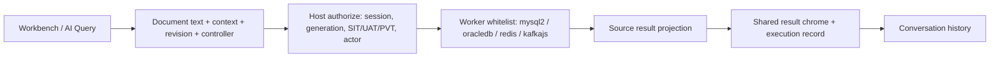
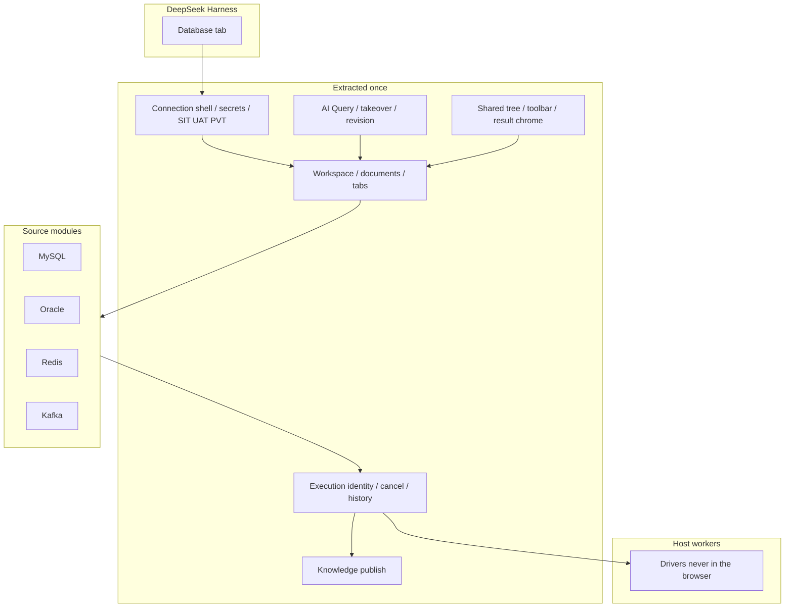

# DSH Database

[](LICENSE)
[](cordis.patch.yml)
[](https://github.com/zhuoxiaoshuai/dsh-database)

**A MySQL, Oracle, Redis, and Kafka workbench for DeepSeek Harness: humans and the model share connections, documents, execution, results, and history.**

🚀 One Database tab | Four sources | Same execution lane

[Why](#why-this-exists) | [Compare](#how-it-compares) | [Highlights](#highlights) | [Try these](#try-these) | [See it in action](#see-it-in-action) | [Quick start](#quick-start-three-steps) | [Sources](#sources) | [What the model calls](#what-the-model-calls) | [How it works](#how-it-works) | [Limits](#configuration-and-limits)

🌐 **English** | [中文](README.zh.md)

Current version **0.1.0-alpha.12.15**. Isolation-profile evidence is not a production claim.

> If this plugin is useful, a star helps other DSH users find it.

> [!IMPORTANT]
> **SIT sends query cells to the model unredacted.** UAT / PVT refuse AI writes. Passwords never go back to the browser snapshot. Treat every saved connection as giving the Host process that account. See [SECURITY.md](SECURITY.md).

## Why this exists

DeepSeek Harness already reasons next to your session. The usual ways to touch a database still break that:

- **Paste SQL into the chat.** The model sees (or invents) connection strings, cannot open a catalog, cannot cancel a live statement cleanly, and overwrites the text you were editing.
- **Ask a SQL-in-chat agent.** Natural language becomes SQL (and often a chart) in the transcript. That is a good report workflow. It is a poor workbench: you cannot take over the same editor, Redis/Kafka get forced into tables, and peek may join a real consumer group.
- **Keep Navicat on the other screen.** The model is blind. You screenshot grids. Nobody shares history.
- **Ship four mini-plugins.** Each clones AI Query, history, and chrome. Redis gets faked as SQL. Kafka peek quietly joins a consumer group.

This plugin puts **one Database tab** in the conversation. Humans and the model share the same connection, the same document, the same execution record, and the same result. Redis stays Redis. Kafka peek uses a throwaway `dsh-peek-*` group with `autoCommit: false` and never commits offsets.

High-star DSH plugins sell a *boundary*, not a feature dump. [Vision Toolkit](https://github.com/Anionex/dsh-vision-toolkit) keeps pixels and local image work on one side of the agent. [dsh-context](https://github.com/bowenliang123/dsh-context) answers “what is in the window right now.” Database does the same for data sources: **the Host holds drivers and secrets; the workbench holds the document; the source module holds native semantics.**

## How it compares

| | Chat paste | SQL-in-chat agent | External IDE | This plugin |
| --- | --- | --- | --- | --- |
| Model can run what you see | Only if you paste it | A shadow statement in the tool call | No | **AI Query** is the same document |
| You can take over | Fight the next token | Edit the next prompt | N/A | Typing sets `controller: user`; AI cannot overwrite |
| Redis / Kafka | Pretend they are SQL | Usually out of scope | Other products | SCAN cursor / bounded peek |
| Charts / NL report | Screenshot | Often yes | Dedicated BI | **Not this plugin** — exact cells in a workbench |
| Secrets | Often in context | Env / Settings | Local files | Host-only; Windows DPAPI; stripped from snapshots |
| Environment | None | Per-source read-only flags | None | SIT write / UAT·PVT read-only / DDL human-gated |
| Cancel / timeout / unknown | Chat status | Tool-dependent | Tool-dependent | First-class execution states |

**One-line take:** not a SQL chatbot and not a second Navicat. It is the conversation-side workbench where the model is a coworker on the same lane.

Community SQL-in-chat plugins (for example [tomowang/dsh-data-agent](https://github.com/tomowang/dsh-data-agent)) are the right tool when the job is **natural language → SQL → chart in the transcript**. Use this plugin when the job is a **shared workbench**: catalog, native Redis/Kafka pages, typing takeover, Host-held drivers. PostgreSQL, ClickHouse, and bar/line/pie charts are not in this package.

## Highlights

- **Open a table the way you already work.** Catalog on the left, tabs on the right (overview / query / **AI Query** / knowledge / history). Four sources, one chrome.
- **The model runs your document, not a shadow copy.** History opens the text that ran. Activity on another connection is a hint bar, not a steal.
- **Typing is takeover.** `ExecutionDocument` has `text`, `context`, `revision`, and `controller`. If you edit, `controller` becomes `user`. AI publish is rejected until you hand it back. Run also checks revision so a stale tab cannot fire.
- **Drivers never enter the browser.** mysql2, oracledb, redis, and kafkajs load only in Host workers. The client talks authenticated plugin HTTP.
- **Environment is a gate, not a badge.** SIT follows the DB account (AI may DML / `redis_execute`). UAT / PVT: production-like connections read-only; AI writes refused.
- **Native pages, honest cells.** SQL uses `LIMIT` / `OFFSET FETCH`. Redis uses SCAN (empty pages happen; the UI says so). Kafka peek is bounded. BIGINT and exact decimals stay strings. BLOB is `[BLOB n bytes]`, not a dumped buffer.
- **Secrets stay on the Host.** Remember-password is off by default. On Windows it is current-user DPAPI over stdin, not argv. Encrypted remember-password is Windows-only. Custom CAs follow the same strip.

This project has two layers:

1. **Extracted workbench** — workspace, AI Query, takeover, execution, history, knowledge, chrome. Once.
2. **Source modules** — protocol, objects, authorize, result shape. Four today; new ones should copy Kafka (`standard` + `standard-text`), not clone MySQL.

```sh
npm pack
dsh plugin --profile web add ./dsh-database-0.1.0-alpha.12.15.tgz
```

**Contents**

- [Why this exists](#why-this-exists)
- [How it compares](#how-it-compares)
- [Highlights](#highlights)
- [Who it is for](#who-it-is-for)
- [Try these](#try-these)
- [See it in action](#see-it-in-action)
- [Quick start: three steps](#quick-start-three-steps)
- [Sources](#sources)
- [What the model calls](#what-the-model-calls)
- [How it works](#how-it-works)
- [Configuration and limits](#configuration-and-limits)
- [Troubleshooting](#troubleshooting)
- [FAQ](#faq)
- [Development and community](#development-and-community)

## Who it is for

1. You already live in DeepSeek Harness and want MySQL / Oracle / Redis / Kafka **beside the conversation**, not in another window the model cannot see.
2. You want the model to run the **same** SQL, Redis command, or Kafka peek you can open, edit, and take over — not a parallel agent console.
3. You care that peek does not join the business consumer group, that Redis `MULTI` does not stick on the key browser, and that `9007199254740993` does not become `9007199254740992`.

## Try these

Say this in the conversation after a connection is live. The SQL, command, or peek lands in **AI Query** so you can edit it and take over.

| You say | What actually happens |
| --- | --- |
| Look at table `orders` and show the latest 20 rows | Catalog via `database_catalog` (not `information_schema`). SQL via `database_execute_sql`. You can change `LIMIT` before it runs again. |
| The model wrote a `DELETE` — stop, I will edit it | First keystroke sets `controller: user`. Further AI publish is rejected until you hand it back. |
| What type and TTL is Redis key `user:42`? | `redis_value` on the SCAN connection. The CLI console is a **different** socket, so `SELECT` / `MULTI` do not leak onto the browser. |
| Peek partition 0 of topic `orders`, latest 20 messages | `kafka_peek` creates `dsh-peek-{uuid}`, `autoCommit: false`, seeks one partition, then disconnects. It does not join `billing`. |
| Save this SQL as knowledge | `database_templates` stores text. Save does not execute. A later run uses the same authorize path. |

## See it in action

### Four sources in one tree

<p align="center">
  
</p>

*Left: MySQL, Oracle, Redis, and Kafka connections. Right: Kafka topics. Query tabs, AI Query, and knowledge stay the same chrome.*

> Prompt example: “List topics on this Kafka connection, then describe `orders`.”

### Kafka topic metadata

<p align="center">
  
</p>

*Partitions, replica factor, leader, and watermarks. Peek uses a temporary consumer and does not join the business group or commit offsets.*

> Prompt example: “Peek partition 0 of `orders` from the latest offset, limit 20. Do not join the billing consumer group.”

### Redis keys and values

<p align="center">
  
</p>

*SCAN tree, key type, TTL, JSON value. The command console is a separate tab and a separate connection, so `SELECT` / `AUTH` / `MULTI` do not leak onto the browser.*

> Prompt example: “What type and TTL is `user:42`? Then GET it in the command console.”

### MySQL result grid

<p align="center">
  
</p>

*BIGINT and exact decimals render as strings. Cells are not executed as HTML.*

> Prompt example: “Show the latest 20 rows from `orders`. Keep BIGINT as text.”

### Oracle catalog

<p align="center">
  
</p>

*Schema tree (case-insensitive). Same SQL workbench as MySQL; Service Name / SID, pagination, and types stay Oracle.*

> Prompt example: “Open schema `HR` and describe `EMPLOYEES`. Do not query `information_schema`.”

Screenshots are the current workbench. Sample names and rows are disposable fixtures, not a business cluster.

## Quick start: three steps

### 1. Install

Requires working DSH (`dsh web`) and Node.js ≥ 24.

```sh
npm pack
dsh plugin --profile web add ./dsh-database-0.1.0-alpha.12.15.tgz
```

After npm publish:

```sh
dsh plugin --profile web add dsh-database
```

Using **DSH Desktop**? It bundles `dsh` and does not add it to PATH. Open **DSH Terminal** from the tray:

```sh
dsh plugin --profile desktop add ./dsh-database-0.1.0-alpha.12.15.tgz
```

Then restart Desktop. `npm run install:desktop` packs a tarball into the profile (set `DSH_DESKTOP_APP` to the install root; no source link).

The bundled `cordis.patch.yml` mounts the plugin. Do not paste the same row into the profile patch. Uninstall: `dsh plugin --profile web remove dsh-database`.

### 2. Restart and open the tab

Restart a running Web Profile. In a conversation, open the **Database** tab, add a connection, **Test**, then **Connect**. Failed edits keep the previous live session.

### 3. Run something you can take over

- MySQL / Oracle: open a table or run SQL. History is conversation-private.
- Redis: pick a DB, browse keys, or run one command in the console.
- Kafka: open a topic, then bounded peek of one partition.

The model uses the same document. Typing takes over immediately.

## Sources

Each source reuses the workbench above. The table is the map; the sections are the real differences.

| Source | Best question | Main result |
| --- | --- | --- |
| MySQL | What is in this database / table? Run this SQL. | Catalog, `SHOW CREATE`, result grid |
| Oracle | Same, on a Service / SID schema | Schema tree, `OFFSET FETCH` grid |
| Redis | What is this key? Run this command. | SCAN tree, type, TTL, value |
| Kafka | What is on this topic? | Partitions, watermarks, bounded peek |

### MySQL

Relational SQL. Objects: **database → table → column**. Identifiers use backticks. Pages: `LIMIT … OFFSET …`. System schemas (`mysql`, `information_schema`, `performance_schema`, `sys`) stay visible. Defaults: `VARCHAR(255)` / `BIGINT`.

- **Connect:** host / port / user / password, default 3306. Driver `mysql2` in the Host worker.
- **Catalog:** tree, search, object home. Columns, indexes, constraints, and `SHOW CREATE` when the account can read them. Missing access is a reason, not a zero.
- **Query:** SQL editor, format, cancel (does not drop the shared login). SELECT uses server-side filter / sort / page. Default 100 rows, cap 500 rows and 1 MiB, 30-second deadline.
- **Writes:** parameterized INSERT/UPDATE/DELETE, preview, one confirmation, primary-key locate and original-row check. Conflicts roll back and keep the draft. DDL up to 20 steps, 5-minute one-shot approval; type the destructive name in the same window. First error stops. No whole-DDL rollback promise. InnoDB lock-wait is verified on throwaway 8.4.
- **AI:** `database_execute_sql`, up to 8 statements on SIT (100 rows each, DML allowed), stop on first error.

### Oracle

Same SQL workbench as MySQL, different dialect. Objects: **Schema** (case-insensitive). Default schema is the username when it exists. Identifiers use `"`. Pages: `OFFSET … ROWS FETCH FIRST … ROWS ONLY`. `EXPLAIN PLAN FOR`. q-quotes yes, `#` comments no.

- **Connect:** Service Name or SID, port 1521, Thin mode. SID is unverified. Driver `oracledb`.
- **Catalog / query / writes:** same platform path as MySQL. Column comments are a separate dictionary. Defaults: `VARCHAR2(255)` / `NUMBER(19)`.
- **Limits:** views and synonyms, metadata only. Queries with LOB columns are unsupported. 19c, SID, and temporal-column maintenance are unverified. Free 23 Thin is not a substitute for 19c.

### Redis

Not SQL. Objects: **DB → Key**, plus type and TTL. A page is a **SCAN cursor** (empty pages and duplicates happen; the UI dedupes and says when the cursor is unfinished). Requires Redis 7.2+.

- **Connect:** standalone, one sentinel, or one cluster seed. Optional ACL, TLS, custom CA. Sentinel asks one address for the master; username/password apply to both. Cluster uses the host as a seed; DB is 0.
- **Two connections on purpose:** one Redis-CLI-quoted command per request, then close. Not a shell.
- **Keys:** String / Hash / List / Set / ZSet / TTL, paged large collections, set/remove TTL, delete, edit basic values. Binary as Base64.
- **Host:** `DSH_REDIS_COMMAND_BLACKLIST` (default empty). AI `redis_execute` is SIT-only; UAT/PVT keep status / keys / value-read.
- **Unverified:** Cluster / Sentinel against production clusters.

### Kafka

Read-only inspect. Objects: **topic / partition / existing consumer group**. Peek is a bounded read of **one** partition. It does not join the business group or commit offsets.

- **Connect:** none, TLS + custom CA, SASL PLAIN, SCRAM-SHA-256 / 512. PLAIN/SCRAM may skip TLS; when TLS is on, certificates are verified (no skip-verify). Kerberos, OAuth, and client certificates are out of scope.
- **Work:** list topics, describe partitions, bounded peek. Result is messages plus metadata, not a SQL grid.
- **Does not:** produce, create/delete topics, change configs, or move consumer offsets.
- **Plug-in:** client `standard` + host `standard-text`. New sources should copy this path, not MySQL.

## What the model calls

Same tools humans use through the tab. Guides stay on-demand (`database_status` with a topic) so they are not stuffed into every turn.

| Tool | Best question | What it does |
| --- | --- | --- |
| `database_status` | Which connections are live? How do I query? | Lists live SQL/Redis connections and `generation`. Pass a topic to load a call guide. |
| `database_catalog` | What is in this schema / table? | `schemas` / `tables` / `table`. Do not use `information_schema` through SQL. Missing access is `unavailable`, not empty. |
| `database_execute_sql` | What is the current SQL? Run this. | `action=read` returns the AI Query text. With `sql`: up to 8 statements on SIT, 100 rows each, stop on first error. UAT/PVT read-only. |
| `database_templates` | Save / search this SQL | Knowledge store. Save does not execute. |
| `database_read_collab` | What tabs are open? | Query-page tabs. `lastRun` is columns, row count, elapsed — not a second result grid. |
| `database_import_connections` | Register these hosts | Registers without password or login. You type the secret in the workbench. |
| `redis_status` / `redis_keys` / `redis_value` | What keys? What is this key? | SCAN cursor (empty pages happen). Type, TTL, paged value. |
| `redis_execute` | Run this Redis command | **SIT only.** One CLI-quoted command on an isolated connection. |
| `kafka_status` / `kafka_topics` / `kafka_describe` | What topics? What is this topic? | Visible topics, partitions, leader, watermarks. |
| `kafka_peek` | What is on this partition? | Bounded read of **one** partition. Publishes into the shared document first; refuses if you already took over. |

Kafka tools write the command into `ExecutionDocument` (`source: 'ai'`), then dispatch only if `controller` is still `ai` and `revision` still matches. SQL `database_execute_sql` is the same idea on the `SharedQuery` path.

## How it works

The plugin is one **extracted data-source platform**, not four mini-IDEs. Adding a source is not cloning the product. Removing a source should leave the platform standing.

High-star DSH plugins sell the *boundary* in prose, not a class diagram. Vision Toolkit contrasts “generic caption bridges” with task-aware vision. Database contrasts **shadow SQL in a tool call** with **one document the human can steal back**.

### A run, end to end



The Database tab is a DSH right-sidebar slot. Connections live in the workspace file; query tabs and AI documents live **per conversation**, so two chats do not share a dirty editor. The browser never loads a driver: it calls authenticated `/plugins/database/...` (401 without credentials). Host `ConnectionService` binds the live session, connection `generation` (reconnect invalidates in-flight work), and environment. Actors are only `user` or `ai` — the browser cannot mint a trusted AI identity.

The source module turns text into a **worker action + input** (`prepareText` / SQL adapter). Runtime checks the action against a whitelist. Kafka only allows the read actions it parsed; it will not produce.

### Most SQL-in-chat tools keep a shadow statement. We keep one document.

When the model calls `kafka_peek` or `database_execute_sql`, it must not hide a second copy of the statement. Kafka tools **publish** into `ExecutionDocument` (`updateExecutionDocument` with `source: 'ai'`), then dispatch only if `controller` is still `ai` and `revision` still matches. You see that text in **AI Query**. History opens the same text. Activity on another connection is a hint bar, not a steal.

Standard sources (Redis, Kafka) use `ExecutionDocument`: `{ text, context, revision, controller }`. SQL still uses `SharedQuery` on the same AI Query tab (legacy path: same takeover rules, same history). The product promise is the same: **one document, one run, one record.**

`SourceWorkspace` is the shared chrome: overview / query / AI Query / knowledge. A source only supplies Editor, Result, `runText`, and tree bindings — it does not wrap a second workbench.

### Typing is takeover, not a race with the next token.

`updateExecutionDocument` rejects AI writes when `controller !== 'ai'` (`用户已接管 AI Query`). The first keystroke calls `saveDraft(..., takeControl=true)` and sets `controller: user` / `user-edit`. Hand-back is explicit (`return-ai`); unsaved text cannot be returned. `runExecutionDocument` requires `controller === 'user'` and a matching `revision`, so a stale tab cannot fire.

`context` is part of the document (Redis DB; Kafka has no extra target today). Switching DB bumps `revision`, **keeps** controller, and cancels the old request scope (`createRequestScope`).

### Peek does not join the business consumer group.

`peekKafkaPartition` creates `dsh-peek-{uuid}`, runs with `autoCommit: false`, seeks **one** partition, then `stop` / `disconnect`. If cleanup times out, the worker is recycled (`recycleWorker`) instead of leaking a group on a dead connection. The GROUPS tree hides names that start with `dsh-peek-` (`visibleGroupIds`).

Redis command console is a **different** connection on purpose: one CLI-quoted command, then close. `SELECT` / `AUTH` / `MULTI` cannot stick on the SCAN browser. `DSH_REDIS_COMMAND_BLACKLIST` is empty by default; Redis ACL is still the account.

### Integers that would lie in JavaScript stay strings at the driver.

MySQL workers set `supportBigNumbers: true` and `bigNumberStrings: true` on catalog, maintenance, and query connections (`mysql/driver.mjs`). Oracle query fetch uses `oracleFetchTypeHandler`: NUMBER and timestamps arrive as STRING. Then `formatFetchedValue` turns BLOB / Buffer into `[BLOB n bytes]`. The grid does not execute cells as HTML. So `9007199254740993` stays that digit string, not `9007199254740992`.

### Environment is a gate, not a badge.

`normalizeEnvironment`: `dev` / `test` → SIT; `staging` → UAT; `prod` → PVT; anything unknown → **UAT**. SIT follows the database account (AI may DML / `redis_execute`; cells go to the model **unredacted**). UAT / PVT: production-like connections read-only; AI writes refused. On those environments, SQL tool results also pass `redactQueryResult` (joins and `SELECT *` omit cells; simple single-table column lists can still pass unless you add column rules). DDL is human-gated.

Passwords never round-trip in the snapshot. Remember-password is off by default. Encrypted remember-password is **Windows-only** (current-user DPAPI over stdin, not argv). Custom CAs follow the same strip.

### Fail visibly.

One execution record: identity, status, events. Success / failure / cancel / empty / partial / **unknown**. A write that times out may already have hit the server — the UI says unknown; it does not pretend rollback.

Worker runs with cancel and a deadline (peek / query default 30 seconds). Redis command isolation and Kafka peek cleanup are part of that same record, not a side channel.

### What is extracted vs what stays native



| Shared once | Left at the source |
| --- | --- |
| Tab, add/test/connect, DPAPI, conversation isolation | Host/port vs Service/SID vs SASL vs Redis mode |
| Tabs, loading/error/empty, result frame | Tree: database / schema / DB / topic |
| Execution identity, cancel, history | `LIMIT`, SCAN cursor, peek offset |
| AI Query, takeover, revision | Command language, authorize, AI args → native text |
| `knowledge.json` publish (human confirm) | Fingerprint / analysis per source |

We do **not** require every source to have `database`, every tree to be Schema/Table, or every result to be a 2-D grid.

| Source | Client | Host execution | Why |
| --- | --- | --- | --- |
| MySQL | `legacy-sql` | `legacy-adapter` | Catalog, batch, InnoDB DML/DDL grid, transactions — still the SQL compatibility path |
| Oracle | `legacy-sql` | `legacy-adapter` | Same path; dialect owns identifiers, `OFFSET FETCH`, comments |
| Redis | `standard` | `legacy-adapter` | Standard pages; command isolation + SCAN still go through the Redis adapter |
| Kafka | `standard` | `standard-text` | `normalizeContext` / `prepareText` / `authorize` → worker whitelist. **Copy this for a new source.** |

Knowledge save does not execute. A trial run uses the same authorize path. Old `sql-templates.json` still reads once into `knowledge.json`.

Rules we keep: one authority per piece of state; AI and humans are the same pipeline; fail visibly; do not unify Kafka offsets with Redis SCAN; adding a source should not rewrite MySQL.

Longer notes: [docs/README.md](docs/README.md), [architecture](docs/data-source-architecture.md), [onboarding a source](docs/data-source-onboarding.md).

## Configuration and limits

### Environment

| Environment | Human | AI |
| --- | --- | --- |
| SIT | Account permissions apply | Unredacted cells; DML allowed; Redis `redis_execute` allowed |
| UAT / PVT | Production-like connections read-only | Writes refused; Redis execute refused |
| DDL | Human confirmation | Not auto-run |

Unknown, empty, or unrecognized tags fail-safe to **UAT**. Aliases: `dev` / `test` → SIT; `staging` → UAT; `prod` → PVT. See [SECURITY.md](SECURITY.md).

### What we do not claim

- Views and synonyms: metadata only. Oracle queries with LOB columns are unsupported.
- Oracle 19c, SID, and temporal-column maintenance are unverified.
- Redis Cluster / Sentinel and production clusters are unverified.
- Kafka does not produce, change offsets, or support Kerberos / OAuth / client certificates.
- No PostgreSQL, ClickHouse, MongoDB, Elasticsearch, or bar/line/pie charts in this package.
- Live Desktop GUI and real model `callId` correlation remain unrun.

| Environment | Notes |
| --- | --- |
| Node.js | ≥ 24; isolated loads use Desktop's bundled Node |
| Harness | Verified `0.1.2-rc.1`, `0.1.7-rc.2`, `0.2.0-rc.2` |
| MySQL | 8.4.x throwaway containers; 8.0.32 read-only check |
| Oracle | Free 23 Thin mode; not a substitute for 19c / SID |
| Redis | 8.10.2 throwaway containers |
| Drivers | mysql2 3.24.4, oracledb 7.0.1, redis 6.2.1, kafkajs 2.2.4 |

## Troubleshooting

| Problem | What to do |
| --- | --- |
| `/plugins/database/connections` collides | Do not install an older remote-exec that still embeds the database workbench. This plugin can sit beside `dsh-remote-exec` |
| `dsh` is not recognized on Desktop | Open **DSH Terminal** from the tray; Desktop does not put `dsh` on PATH |
| Plugin does not appear after add | Restart the Web Profile and refresh. Confirm `cordis.patch.yml` was not duplicated by hand |
| Oracle query fails on LOB columns | Unsupported in the current version; metadata-only for views/synonyms |
| Redis `SELECT` in the console does not change the key tree | Expected: the console closes its connection; pick a DB in the tree |
| Kafka peek moves a business consumer | It does not. Peek uses a temporary `dsh-peek-*` group, `autoCommit: false`, then disconnects |

## FAQ

**Will the model see my passwords?**

No. Passwords and custom CAs are stripped from connection snapshots, logs, query history, and model-facing output. Remember-password (Windows DPAPI, current user) never round-trips to the browser.

**Will the model see row data?**

On **SIT**, yes — cells go unredacted. That is the point of asking the model about a result. Use **UAT / PVT** when the connection is production-like: AI writes are refused, Redis execute is refused, and SQL tool results pass `redactQueryResult` (joins and `SELECT *` omit cells; simple single-table column lists can still pass unless you add column rules).

**Is this a replacement for Navicat?**

No. It is the workbench *inside* DSH: catalog, query, AI Query, history next to the conversation. Heavy DBA work still belongs in a dedicated client. Controlled DML/DDL here is parameterized, previewed, and confirmation-gated — not a second general SQL IDE.

**Is this a replacement for SQL-in-chat / data-agent plugins?**

No. Those optimize for natural language, charts, and reports in the transcript. This plugin optimizes for a **shared workbench** (takeover, Redis SCAN, Kafka peek isolation, Host drivers). You can install both; they do different jobs.

**Can I add PostgreSQL / Mongo / ES?**

The platform is built for that: copy Kafka's `standard` + `standard-text` module (descriptor, worker, authorize, explorer, knowledge). Do not clone MySQL. There is no PostgreSQL/Mongo/ES implementation in this package today.

**Why is Kafka peek slow to disconnect?**

The worker stops and disconnects the temporary consumer with a timeout. If cleanup fails, the worker is recycled (`recycleWorker`) instead of leaking a group on a dead connection.

## Development and community

```sh
npm ci --legacy-peer-deps
npm run check
```

Live-database scripts create uniquely labelled Docker containers and delete them. Do not point them at business databases.

```sh
npm run test:mysql
npm run test:oracle
DSH_TEST_REDIS=1 npm run test:host
DSH_TEST_DATABASES=1 npm run test:host
```

Isolated host: `DSH_DESKTOP_APP=... npm run test:host`. `DSH_TEST_ALLOW_VERSION` is diagnostic only.

- Bugs and usage questions: [GitHub Issues](https://github.com/zhuoxiaoshuai/dsh-database/issues)
- Vulnerabilities: privately via [SECURITY.md](SECURITY.md)
- After the repository is at least one day old, list it on [awesome-dsh-plugin](https://github.com/awesome-dsh-plugin/awesome-dsh-plugin) as `data/plugins/zhuoxiaoshuai__dsh-database.yml` (topic `dsh-plugin` is already set)

```yaml
url: https://github.com/zhuoxiaoshuai/dsh-database
name: zhuoxiaoshuai/dsh-database
category: dev
description:
  en: MySQL, Oracle, Redis, and Kafka workbench for DeepSeek Harness, with a shared execution path for humans and the model.
  zh: DeepSeek Harness 的 MySQL、Oracle、Redis、Kafka 工作台，人和模型共用同一套连接、执行和记录。
```

## License

[MIT](LICENSE)
