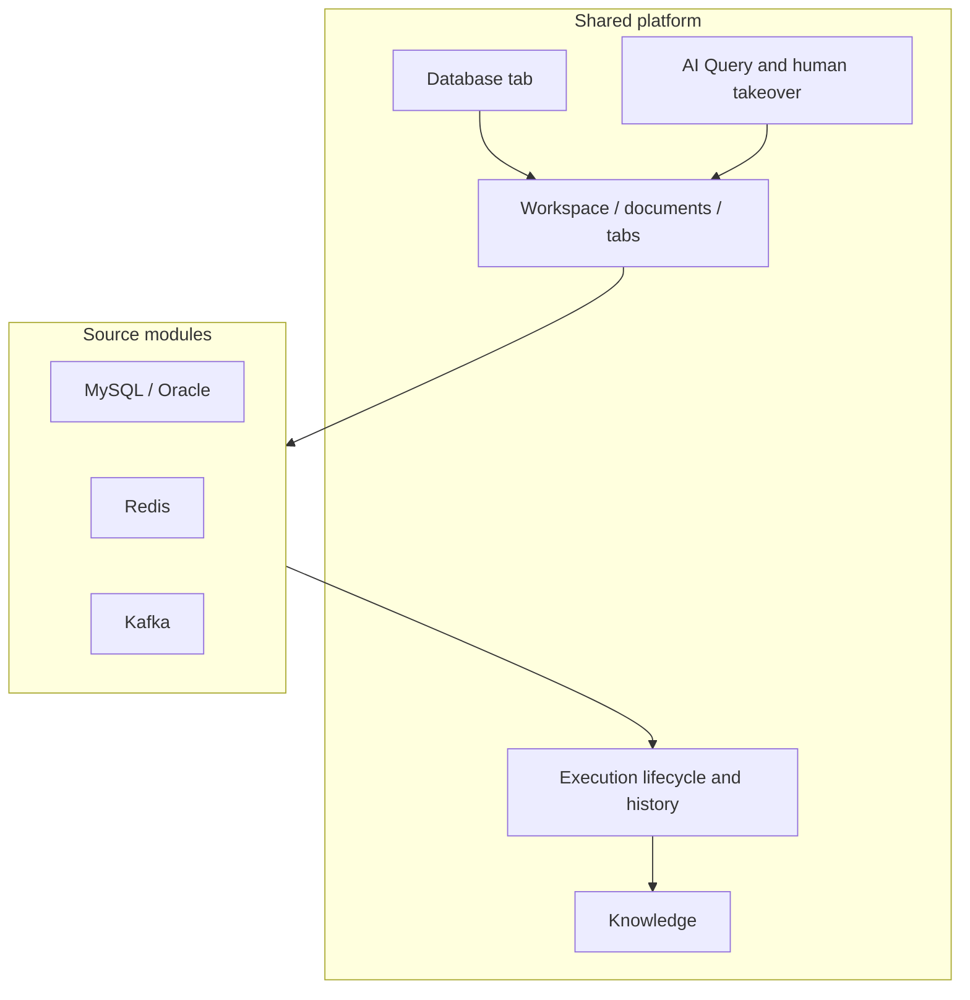

# dsh-database

<div align="center">
  🌏 <a href="./README.md"><b>English</b></a> · <a href="./README.zh.md">中文</a>
</div>

<br />

[](LICENSE)
[](https://github.com/zhuoxiaoshuai/dsh-database)
[](README.zh.md)

MySQL, Oracle, Redis, and Kafka workbench for [DeepSeek Harness](https://github.com/deepseek-ai/deepseek-harness). Humans and the model share connections, documents, execution, results, and history.

Current version **0.1.0-alpha.12.15**.

<p align="center">
  
</p>

<p align="center"><sub>The plugin registers a <b>Database</b> tab next to the conversation. Connections are workspace-scoped; query workbenches follow the conversation.</sub></p>

## Highlights

- **One workbench, four sources.** MySQL, Oracle, Redis, and Kafka sit in the same right-sidebar tab. Adding a source means registering its real differences, not cloning the product.
- **Humans and the model share the lane.** The supported AI surface is **AI Query** in the workbench. Whatever the user typed, the model executes; whatever the model ran, the user can open, take over, and keep.
- **Execution is a first-class object.** Each run has identity, generation, cancel, timeout, history, and a result that is honest about success, failure, cancel, empty, and unknown.
- **Environment is a gate, not a label.** SIT can write. UAT / PVT stay read-only for AI and for production-like connections. DDL still needs a human confirmation step.
- **Secrets stay on the host.** Passwords and custom CAs never go back to the browser snapshot, logs, query history, or model output. Remember-password on Windows uses current-user DPAPI.
- **Sources keep their own semantics.** Redis is not SQL. Kafka peek does not join a consumer group or commit offsets. Pagination, cursors, and result shapes stay native.

## Screenshots

These were taken from an isolated DSH Web profile running the installed plugin against throwaway Docker fixtures (MySQL 8.4 / Oracle Free 23). They are not production clusters.

| Database tab beside the session | MySQL catalog, SQL, AI Query |
| --- | --- |
|  |  |

| Result grid (exact decimals as strings) | Oracle catalog |
| --- | --- |
|  |  |

## What you can do

### Connections

- Add MySQL, Oracle, Redis, or Kafka from the same form shell. Dialect-specific fields (Service Name / SID, Redis DB / ACL / TLS, Kafka SASL) stay with the source.
- Test, then connect. Failed edits keep the previous live session.
- Workspace list: `$DSH_HOME/database/database-workspace.json`. Query tabs, drafts, and history: `conversation-workbenches/` per conversation.
- Remember password is off by default. When on (Windows), DPAPI encrypts the secret for the current OS user only.
- SIT / UAT / PVT is chosen on the connection. Production-like connections stay read-only in the workbench.

### MySQL and Oracle

- Catalog tree: databases / schemas, tables, search. Object home shows columns, indexes, constraints, and `SHOW CREATE` / DDL text when the account can read them. Missing access is shown as a reason, not as zero.
- SQL editor with format, cancel (does not drop the shared login), conversation-private history, and a workspace-shared experience library (normalize, similar-merge suggestion, human publish).
- SELECT with server-side filter / sort / page. Default 100 rows, cap 500 rows and 1 MiB, 30-second request deadline.
- Controlled DML: insert / update / delete generate parameterized statements, preview, one confirmation, primary-key locate and original-row check. Conflicts roll back and keep the draft.
- Controlled DDL: create table, columns, indexes, comments, rename, truncate / drop, up to 20 steps, 5-minute one-shot approval. Destructive names are typed in the same window. First error stops. There is no promise of whole-DDL rollback.
- Large integers and exact decimals render as strings. Results are not executed as HTML.

### Redis 7.2+

- Standalone, one sentinel, or one cluster seed. Optional ACL user, TLS, custom CA. Sentinel asks one address for the master; username/password apply to both sentinel and Redis. Cluster uses the host as a seed; DB is 0.
- Command console: one command at a time, Redis-CLI quoting, not a shell. Each command opens its own connection and closes it, so `SELECT` / `AUTH` / `MULTI` do not leak onto the key browser.
- Key browser via `SCAN` (empty pages and duplicates are possible; the UI dedupes and says when the cursor is unfinished). String / Hash / List / Set / ZSet / TTL, paged large collections, set/remove TTL, delete, edit basic values. Binary shows as Base64.
- Host command blacklist defaults empty; `DSH_REDIS_COMMAND_BLACKLIST` can list commands. AI on UAT/PVT cannot call `redis_execute`.

### Kafka

- List topics, inspect topic / partition metadata, bounded peek of one partition.
- Does not produce, create/delete topics, change configs, or commit consumer offsets. Peek does not join the business consumer group.
- Auth: none, TLS, custom CA, SASL PLAIN, SCRAM-SHA-256 / 512. PLAIN/SCRAM may skip TLS; when TLS is on, certificates are verified (custom CA allowed, skip-verify is not).
- Kerberos, OAuth, and client-certificate auth are out of scope.

### AI and takeover

- Entry: workbench **AI Query**, not a separate agent console.
- SIT: cell values are sent to the model unredacted; `database_execute_sql` may run up to 8 statements (100 rows each), including INSERT/UPDATE/DELETE, stop on first error.
- UAT / PVT: AI writes refused. Redis is limited to status / keys / value-read tools.
- Clicking history opens the document that was or will be executed. Activity on another connection only shows a hint bar; it does not steal the current connection.
- Typing in the editor takes over immediately: the model stops writing that document. Hand back before the model may continue.

### Knowledge

SQL experience and Redis knowledge share `knowledge.json` (first read still accepts the old `sql-templates.json`). Fingerprints and save checks are source-specific. Publish is a human confirmation.

## Architecture

The product is a **shared data-source workbench**, not four mini-IDEs. Workspace, AI collaboration, takeover, execution lifecycle, history, knowledge, and the chrome of the UI exist once. A source only implements what is actually different: connection protocol, object model, command language, authorization, result shape, completion, and AI translation.



| Layer | Owns | Does not own |
| --- | --- | --- |
| Platform | Flow, lifecycle, conversation isolation, revision, cancel, history, shared chrome | Host/port fields, SQL vs RESP vs peek, how a page of keys is scanned |
| Source module | Driver/worker, validate/fingerprint, objects, authorize, result projection, completion | A second AI page, a second history store, a copied toolbar |

Host workers load drivers. The browser does not. SQL still uses a legacy adapter for batch/maintenance/grid; Redis/Kafka use the standard workbench bindings. New sources are expected to follow standard + standard-text rather than copy MySQL.

Longer notes: [docs/README.md](docs/README.md), [architecture](docs/data-source-architecture.md), [onboarding a source](docs/data-source-onboarding.md).

## Design rules we actually keep

1. **One authority for one piece of state.** Derived views are allowed; two writable copies are not.
2. **AI and humans are the same pipeline.** No parallel “agent workbench” per dialect.
3. **Fail visibly.** Cancel, timeout, empty, partial, and unknown are distinct. Maintenance timeouts may leave the server state unknown — the UI says so.
4. **Do not unify Kafka offsets with Redis SCAN just to make the code rhyme.** Unify the path the user walks.
5. **Removing a source should leave the platform standing.** Adding a source should not rewrite MySQL.

## Environment policy

| Environment | Human | AI |
| --- | --- | --- |
| SIT | Account permissions apply | Unredacted cells; DML allowed; Redis `redis_execute` allowed |
| UAT / PVT | Production-like connections read-only | Writes refused; Redis execute refused |
| DDL | Human confirmation | Not auto-run |

See [SECURITY.md](SECURITY.md).

## Install

Requires working DSH (`dsh web`) and Node.js ≥ 24.

```sh
npm pack
dsh plugin --profile web add ./dsh-database-0.1.0-alpha.12.15.tgz
```

After npm publish:

```sh
dsh plugin --profile web add dsh-database
```

The bundled `cordis.patch.yml` mounts the plugin. Do not paste the same row into the profile patch. Uninstall with `dsh plugin --profile web remove dsh-database`.

Do not install an older remote-exec build that still embeds the database workbench: both claim `/plugins/database/connections`. This plugin can sit beside `dsh-remote-exec`.

## Limits

- Views and synonyms: metadata only; Oracle queries with LOB columns are unsupported.
- Oracle 19c, SID, and temporal-column maintenance are unverified.
- Redis Cluster / Sentinel and production clusters are unverified.
- Kafka does not produce, change offsets, or support Kerberos / OAuth / client certificates.
- Live Desktop GUI and real model `callId` correlation remain unrun. Isolation-profile evidence is not a production claim.

| Environment | Notes |
| --- | --- |
| Node.js | ≥ 24; isolated loads use Desktop's bundled Node |
| Harness | Verified `0.1.2-rc.1`, `0.1.7-rc.2`, `0.2.0-rc.2` |
| MySQL | 8.4.x throwaway containers; 8.0.32 read-only check |
| Oracle | Free 23 Thin mode; not a substitute for 19c / SID |
| Redis | 8.10.2 throwaway containers |
| Drivers | mysql2 3.24.4, oracledb 7.0.1, redis 6.2.1, kafkajs 2.2.4 |

## Development

```sh
npm ci --legacy-peer-deps
npm run check
```

Live-database scripts create uniquely labelled Docker containers and delete them. Do not point them at business databases.

```sh
npm run test:mysql
npm run test:oracle
DSH_TEST_REDIS=1 npm run test:host
DSH_TEST_DATABASES=1 npm run test:host
```

Set `DSH_DESKTOP_APP` to the Desktop install root, then `npm run install:desktop` (tarball into the profile, no source link). Isolated host: `DSH_DESKTOP_APP=... npm run test:host`. `DSH_TEST_ALLOW_VERSION` is diagnostic only.

## Listing

After the repository is at least one day old, submit `data/plugins/zhuoxiaoshuai__dsh-database.yml` to [awesome-dsh-plugin](https://github.com/awesome-dsh-plugin/awesome-dsh-plugin):

```yaml
url: https://github.com/zhuoxiaoshuai/dsh-database
name: zhuoxiaoshuai/dsh-database
category: dev
description:
  en: MySQL, Oracle, Redis, and Kafka workbench for DeepSeek Harness, with a shared execution path for humans and the model.
  zh: DeepSeek Harness 的 MySQL、Oracle、Redis、Kafka 工作台，人和模型共用同一套连接、执行和记录。
```

Topic `dsh-plugin` is already set.

## License

MIT
