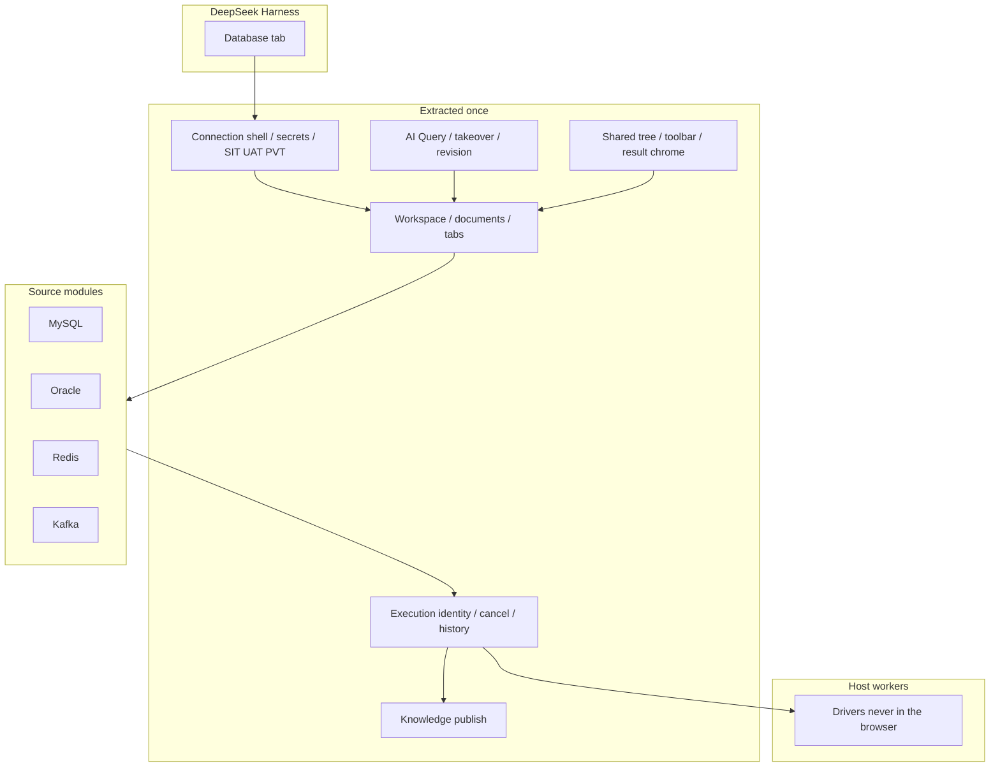

# DSH Database

[](LICENSE)
[](cordis.patch.yml)
[](https://github.com/zhuoxiaoshuai/dsh-database)

**A MySQL, Oracle, Redis, and Kafka workbench for DeepSeek Harness: humans and the model share connections, documents, execution, results, and history.**

🚀 One Database tab | Four sources | Same execution lane

[Highlights](#highlights) | [Who it is for](#who-it-is-for) | [See it in action](#see-it-in-action) | [Quick start](#quick-start-three-steps) | [Sources](#sources) | [How it works](#how-it-works) | [Limits](#configuration-and-limits)

🌐 **English** | [中文](README.zh.md)

Current version **0.1.0-alpha.12.15**. Isolation-profile evidence is not a production claim.

> If this plugin is useful, a star helps other DSH users find it.

## Highlights

- **One tab, four sources.** MySQL, Oracle, Redis, and Kafka sit in the Database tab next to the conversation. Adding a source means registering its real differences, not cloning the product.
- **Paste is not a second product.** The supported AI surface is **AI Query** in the workbench. Whatever you typed, the model executes; whatever the model ran, you can open, take over, and keep.
- **Execution is a first-class object.** Each run has identity, generation, cancel, timeout, and history. Success, failure, cancel, empty, partial, and unknown stay distinct.
- **Environment is a gate.** SIT can write. UAT / PVT stay read-only for AI and for production-like connections. DDL still needs a human confirmation step.
- **Secrets stay on the host.** Passwords and custom CAs never return in snapshots, logs, query history, or model output. Remember-password on Windows uses current-user DPAPI.

This project has two layers:

1. **An extracted workbench:** workspace, AI Query, takeover, execution, history, knowledge, and UI chrome exist once.
2. **Four source modules:** each owns protocol, objects, commands, authorize, and result shape.

```sh
dsh plugin --profile web add ./dsh-database-0.1.0-alpha.12.15.tgz
```

**Contents**

- [Highlights](#highlights)
- [Who it is for](#who-it-is-for)
- [See it in action](#see-it-in-action)
- [Quick start: three steps](#quick-start-three-steps)
- [Sources](#sources)
- [How it works](#how-it-works)
- [Configuration and limits](#configuration-and-limits)
- [Troubleshooting](#troubleshooting)
- [Development and community](#development-and-community)

## Who it is for

1. You already use DeepSeek Harness and want MySQL / Oracle / Redis / Kafka beside the conversation, not in a separate IDE.
2. You want the model to run the same SQL, Redis command, or Kafka peek a human can open, edit, and take over — not a parallel “agent console” per dialect.

## See it in action

### Four sources in one tree

<p align="center">
  
</p>

*Left: MySQL, Oracle, Redis, and Kafka connections. Right: Kafka topics. Query tabs, AI Query, and knowledge stay the same chrome.*

### Kafka topic metadata

<p align="center">
  
</p>

*Partitions, replica factor, leader, and watermarks. Peek uses a temporary consumer and does not join the business group or commit offsets.*

### Redis keys and values

<p align="center">
  
</p>

*SCAN tree, key type, TTL, JSON value. The command console is a separate tab and a separate connection, so `SELECT` / `AUTH` / `MULTI` do not leak onto the browser.*

### MySQL result grid

<p align="center">
  
</p>

*BIGINT and exact decimals render as strings. Cells are not executed as HTML.*

### Oracle catalog

<p align="center">
  
</p>

*Schema tree (case-insensitive). Same SQL workbench as MySQL; Service Name / SID, pagination, and types stay Oracle.*

Screenshots are the current workbench. Sample names and rows are disposable fixtures, not a business cluster.

## Quick start: three steps

### 1. Install

Requires working DSH (`dsh web`) and Node.js ≥ 24.

```sh
npm pack
dsh plugin --profile web add ./dsh-database-0.1.0-alpha.12.15.tgz
```

After npm publish:

```sh
dsh plugin --profile web add dsh-database
```

Using **DSH Desktop**? It bundles `dsh` and does not add it to PATH. Open **DSH Terminal** from the tray:

```sh
dsh plugin --profile desktop add ./dsh-database-0.1.0-alpha.12.15.tgz
```

Then restart Desktop. `npm run install:desktop` packs a tarball into the profile (set `DSH_DESKTOP_APP` to the install root; no source link).

The bundled `cordis.patch.yml` mounts the plugin. Do not paste the same row into the profile patch. Uninstall: `dsh plugin --profile web remove dsh-database`.

### 2. Restart and open the tab

Restart a running Web Profile. In a conversation, open the **Database** tab, add a connection, **Test**, then **Connect**. Failed edits keep the previous live session.

### 3. Run something you can take over

- MySQL / Oracle: open a table or run SQL. History is conversation-private.
- Redis: pick a DB, browse keys, or run one command in the console.
- Kafka: open a topic, then bounded peek of one partition.

The model uses the same document. Typing takes over immediately.

## Sources

Each source reuses the workbench above. The table is the map; the sections are the real differences.

| Source | Best question | Main result |
| --- | --- | --- |
| MySQL | What is in this database / table? Run this SQL. | Catalog, `SHOW CREATE`, result grid |
| Oracle | Same, on a Service / SID schema | Schema tree, `OFFSET FETCH` grid |
| Redis | What is this key? Run this command. | SCAN tree, type, TTL, value |
| Kafka | What is on this topic? | Partitions, watermarks, bounded peek |

### MySQL

Relational SQL. Objects: **database → table → column**. Identifiers use backticks. Pages: `LIMIT … OFFSET …`. System schemas (`mysql`, `information_schema`, `performance_schema`, `sys`) stay visible. Defaults: `VARCHAR(255)` / `BIGINT`.

- **Connect:** host / port / user / password, default 3306. Driver `mysql2` in the Host worker.
- **Catalog:** tree, search, object home. Columns, indexes, constraints, and `SHOW CREATE` when the account can read them. Missing access is a reason, not a zero.
- **Query:** SQL editor, format, cancel (does not drop the shared login). SELECT uses server-side filter / sort / page. Default 100 rows, cap 500 rows and 1 MiB, 30-second deadline.
- **Writes:** parameterized INSERT/UPDATE/DELETE, preview, one confirmation, primary-key locate and original-row check. Conflicts roll back and keep the draft. DDL up to 20 steps, 5-minute one-shot approval; type the destructive name in the same window. First error stops. No whole-DDL rollback promise. InnoDB lock-wait is verified on throwaway 8.4.
- **AI:** `database_execute_sql`, up to 8 statements on SIT (100 rows each, DML allowed), stop on first error.

### Oracle

Same SQL workbench as MySQL, different dialect. Objects: **Schema** (case-insensitive). Default schema is the username when it exists. Identifiers use `"`. Pages: `OFFSET … ROWS FETCH FIRST … ROWS ONLY`. `EXPLAIN PLAN FOR`. q-quotes yes, `#` comments no.

- **Connect:** Service Name or SID, port 1521, Thin mode. SID is unverified. Driver `oracledb`.
- **Catalog / query / writes:** same platform path as MySQL. Column comments are a separate dictionary. Defaults: `VARCHAR2(255)` / `NUMBER(19)`.
- **Limits:** views and synonyms, metadata only. Queries with LOB columns are unsupported. 19c, SID, and temporal-column maintenance are unverified. Free 23 Thin is not a substitute for 19c.

### Redis

Not SQL. Objects: **DB → Key**, plus type and TTL. A page is a **SCAN cursor** (empty pages and duplicates happen; the UI dedupes and says when the cursor is unfinished). Requires Redis 7.2+.

- **Connect:** standalone, one sentinel, or one cluster seed. Optional ACL, TLS, custom CA. Sentinel asks one address for the master; username/password apply to both. Cluster uses the host as a seed; DB is 0.
- **Two connections on purpose:** one Redis-CLI-quoted command per request, then close. Not a shell.
- **Keys:** String / Hash / List / Set / ZSet / TTL, paged large collections, set/remove TTL, delete, edit basic values. Binary as Base64.
- **Host:** `DSH_REDIS_COMMAND_BLACKLIST` (default empty). AI `redis_execute` is SIT-only; UAT/PVT keep status / keys / value-read.
- **Unverified:** Cluster / Sentinel against production clusters.

### Kafka

Read-only inspect. Objects: **topic / partition / existing consumer group**. Peek is a bounded read of **one** partition. It does not join the business group or commit offsets.

- **Connect:** none, TLS + custom CA, SASL PLAIN, SCRAM-SHA-256 / 512. PLAIN/SCRAM may skip TLS; when TLS is on, certificates are verified (no skip-verify). Kerberos, OAuth, and client certificates are out of scope.
- **Work:** list topics, describe partitions, bounded peek. Result is messages plus metadata, not a SQL grid.
- **Does not:** produce, create/delete topics, change configs, or move consumer offsets.
- **Plug-in:** client `standard` + host `standard-text`. New sources should copy this path, not MySQL.

## How it works

The plugin is one **extracted data-source platform**, not four mini-IDEs. Adding a source is not cloning the product. Removing a source should leave the platform standing.



**What is shared once:** Database tab; workspace connections (`$DSH_HOME/database/database-workspace.json`) vs conversation workbenches (`conversation-workbenches/`); add / test / connect / edit; AI Query and takeover; execution identity and history; one `knowledge.json` (first read still accepts `sql-templates.json`); SIT / UAT / PVT.

**What stays at the source:** connection fields, driver/worker, objects, command language, authorize, how a page is read (`LIMIT`, `SCAN`, peek offset), result shape, completion, AI arguments → native text.

The platform does **not** require host/port/database on every source, Schema/Table on every tree, or SQL for Redis/Kafka.

| Source | Client | Host execution |
| --- | --- | --- |
| MySQL | `legacy-sql` | `legacy-adapter` |
| Oracle | `legacy-sql` | `legacy-adapter` |
| Redis | `standard` | `legacy-adapter` |
| Kafka | `standard` | `standard-text` |

New sources should follow **standard + standard-text**. SQL/Redis adapters are a compatibility boundary, not a template.

Manual or model: document → authorize → worker action whitelist → source result projection → shared result chrome → history. One lane.

Rules we keep: one authority per piece of state; AI and humans are the same pipeline; fail visibly (including unknown after a maintenance timeout); do not unify Kafka offsets with Redis SCAN; adding a source should not rewrite MySQL.

Longer notes: [docs/README.md](docs/README.md), [architecture](docs/data-source-architecture.md), [onboarding a source](docs/data-source-onboarding.md).

## Configuration and limits

### Environment

| Environment | Human | AI |
| --- | --- | --- |
| SIT | Account permissions apply | Unredacted cells; DML allowed; Redis `redis_execute` allowed |
| UAT / PVT | Production-like connections read-only | Writes refused; Redis execute refused |
| DDL | Human confirmation | Not auto-run |

See [SECURITY.md](SECURITY.md).

### What we do not claim

- Views and synonyms: metadata only. Oracle queries with LOB columns are unsupported.
- Oracle 19c, SID, and temporal-column maintenance are unverified.
- Redis Cluster / Sentinel and production clusters are unverified.
- Kafka does not produce, change offsets, or support Kerberos / OAuth / client certificates.
- Live Desktop GUI and real model `callId` correlation remain unrun.

| Environment | Notes |
| --- | --- |
| Node.js | ≥ 24; isolated loads use Desktop's bundled Node |
| Harness | Verified `0.1.2-rc.1`, `0.1.7-rc.2`, `0.2.0-rc.2` |
| MySQL | 8.4.x throwaway containers; 8.0.32 read-only check |
| Oracle | Free 23 Thin mode; not a substitute for 19c / SID |
| Redis | 8.10.2 throwaway containers |
| Drivers | mysql2 3.24.4, oracledb 7.0.1, redis 6.2.1, kafkajs 2.2.4 |

## Troubleshooting

| Problem | What to do |
| --- | --- |
| `/plugins/database/connections` collides | Do not install an older remote-exec that still embeds the database workbench. This plugin can sit beside `dsh-remote-exec` |
| `dsh` is not recognized on Desktop | Open **DSH Terminal** from the tray; Desktop does not put `dsh` on PATH |
| Plugin does not appear after add | Restart the Web Profile and refresh. Confirm `cordis.patch.yml` was not duplicated by hand |
| Oracle query fails on LOB columns | Unsupported in the current version; metadata-only for views/synonyms |
| Redis `SELECT` in the console does not change the key tree | Expected: the console closes its connection; pick a DB in the tree |
| Kafka peek moves a business consumer | It does not. Peek uses a temporary consumer and does not commit offsets |

## Development and community

```sh
npm ci --legacy-peer-deps
npm run check
```

Live-database scripts create uniquely labelled Docker containers and delete them. Do not point them at business databases.

```sh
npm run test:mysql
npm run test:oracle
DSH_TEST_REDIS=1 npm run test:host
DSH_TEST_DATABASES=1 npm run test:host
```

Isolated host: `DSH_DESKTOP_APP=... npm run test:host`. `DSH_TEST_ALLOW_VERSION` is diagnostic only.

- Bugs and usage questions: [GitHub Issues](https://github.com/zhuoxiaoshuai/dsh-database/issues)
- Vulnerabilities: privately via [SECURITY.md](SECURITY.md)
- After the repository is at least one day old, list it on [awesome-dsh-plugin](https://github.com/awesome-dsh-plugin/awesome-dsh-plugin) as `data/plugins/zhuoxiaoshuai__dsh-database.yml` (topic `dsh-plugin` is already set)

```yaml
url: https://github.com/zhuoxiaoshuai/dsh-database
name: zhuoxiaoshuai/dsh-database
category: dev
description:
  en: MySQL, Oracle, Redis, and Kafka workbench for DeepSeek Harness, with a shared execution path for humans and the model.
  zh: DeepSeek Harness 的 MySQL、Oracle、Redis、Kafka 工作台，人和模型共用同一套连接、执行和记录。
```

## License

[MIT](LICENSE)
