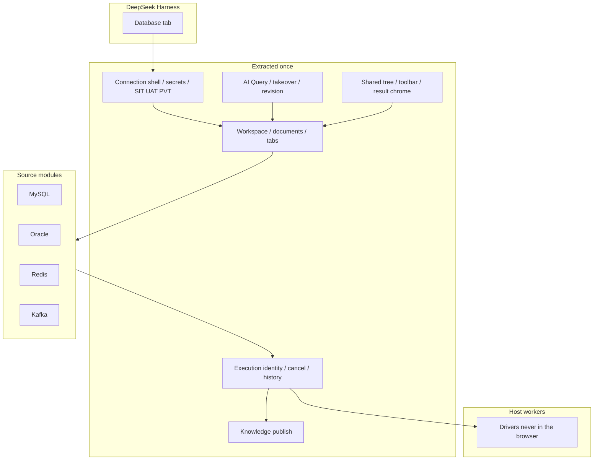

# dsh-database

<div align="center">
  🌏 <a href="./README.md"><b>English</b></a> · <a href="./README.zh.md">中文</a>
</div>

<br />

[](LICENSE)
[](https://github.com/zhuoxiaoshuai/dsh-database)
[](README.zh.md)

MySQL, Oracle, Redis, and Kafka workbench for [DeepSeek Harness](https://github.com/deepseek-ai/deepseek-harness). Humans and the model share connections, documents, execution, results, and history.

Current version **0.1.0-alpha.12.15**.

<p align="center">
  
</p>

<p align="center"><sub>Current workbench: four sources in one tree. Kafka shows topic metadata (partitions, replica factor, watermarks). Peek does not join the business consumer group.</sub></p>

## Highlights

- **Extracted platform, four channels.** MySQL, Oracle, Redis, and Kafka sit in one Database tab. The flow is implemented once; each source only registers what is actually different.
- **Humans and the model share the lane.** The supported AI surface is **AI Query** in the workbench. Whatever the user typed, the model executes; whatever the model ran, the user can open, take over, and keep.
- **Execution is a first-class object.** Each run has identity, generation, cancel, timeout, history, and a result that is honest about success, failure, cancel, empty, and unknown.
- **Environment is a gate, not a label.** SIT can write. UAT / PVT stay read-only for AI and for production-like connections. DDL still needs a human confirmation step.
- **Secrets stay on the host.** Passwords and custom CAs never go back to the browser snapshot, logs, query history, or model output. Remember-password on Windows uses current-user DPAPI.
- **Sources keep their own semantics.** Redis is not SQL. Kafka peek does not join a consumer group or commit offsets. Pagination, cursors, and result shapes stay native.

## Screenshots

Current workbench UI (0.1.0-alpha.12.15). Sample names and rows are disposable fixtures, not a business cluster. BIGINT and exact decimals render as strings.

| Redis keys, TTL, JSON | MySQL result grid |
| --- | --- |
|  |  |

| Oracle catalog | Four sources in one tree |
| --- | --- |
|  |  |

## Architecture

This is one **extracted data-source platform**, not four mini-IDEs glued together. Workspace, AI collaboration, takeover, execution, history, knowledge, secrets, environment gates, and UI chrome exist **once**. MySQL, Oracle, Redis, and Kafka are modules on that platform: each registers real differences and reuses the rest.

Adding a source is not cloning the product. Removing a source should leave the platform standing.



### Extracted once

These do not belong to any dialect. They should keep working if Kafka or Redis is deleted tomorrow.

| Piece | What is shared |
| --- | --- |
| Surface | Right-sidebar **Database** tab. Connections: `$DSH_HOME/database/database-workspace.json` (workspace). Query tabs, drafts, history: `conversation-workbenches/` (conversation). |
| Connection shell | Add / test / connect / edit / copy / disconnect. Failed edits keep the previous live session. Remember-password off by default; Windows uses current-user DPAPI. Passwords and custom CAs never return in snapshots, logs, query history, or model output. |
| Workspace chrome | Left catalog, tabs (overview / query / **AI Query** / knowledge / history), shared loading / error / empty / dialogs. |
| Execution | Identity, generation, cancel, timeout, conversation-scoped history. Success, failure, cancel, empty, partial, and unknown are distinct. |
| AI lane | One document, one execution pipeline. Typing takes over; hand-back before the model may continue. History opens that document. Activity on another connection is a hint bar, not a steal. |
| Knowledge | One `knowledge.json` (first read still accepts `sql-templates.json`). Publish is a human confirmation. Fingerprints stay with the source. |
| Environment | SIT / UAT / PVT on the connection. Production-like connections stay read-only in the workbench. DDL still needs a human step. |

The browser never loads drivers. Host workers do.

### Left at the source

A module owns only what depends on its protocol:

connection fields, driver/worker, validate/fingerprint, object model, command language, authorize, how a page is read (`LIMIT`, `SCAN`, peek offset), result shape, completion, AI arguments → native text, knowledge fingerprint, and capabilities that exist only there.

The platform does **not** require host/port/database on every source, Schema/Table on every tree, a 2-D grid on every result, or SQL for Redis/Kafka.

| Layer | Owns | Does not own |
| --- | --- | --- |
| Platform | Flow, lifecycle, conversation isolation, revision, cancel, history, shared chrome | Field lists, SQL vs RESP vs peek, how a SCAN page looks |
| Source module | Worker, objects, authorize, result projection, completion | A second AI page, a second history store, a copied toolbar |

### How the four channels plug in

| Source | Client | Host execution | Meaning |
| --- | --- | --- | --- |
| MySQL | `legacy-sql` | `legacy-adapter` | Catalog, SQL batch, InnoDB DML/DDL grid, transactions — still on the SQL compatibility path |
| Oracle | `legacy-sql` | `legacy-adapter` | Same SQL path; Service/SID, schema case, pagination, and types stay Oracle |
| Redis | `standard` | `legacy-adapter` | Standard workbench pages; command isolation and SCAN still go through the Redis adapter |
| Kafka | `standard` | `standard-text` | Intended new-source path: `normalizeContext` / `prepareText` / `authorize`, then a worker action whitelist |

New sources should follow **standard + standard-text**, not copy MySQL. The SQL/Redis adapters are a compatibility boundary, not a template.

Manual or model: document → authorize → worker action whitelist → source result projection → shared result chrome → history. One lane.

Longer notes: [docs/README.md](docs/README.md), [architecture](docs/data-source-architecture.md), [onboarding a source](docs/data-source-onboarding.md).

## Connected sources

Each channel below reuses the platform. Only real differences are listed.

### MySQL

Relational SQL. Objects: **database → table → column**. Identifiers use backticks. Pages: `LIMIT … OFFSET …`. System schemas (`mysql`, `information_schema`, `performance_schema`, `sys`) stay visible. Defaults: `VARCHAR(255)` / `BIGINT`. `#` comments and `EXPLAIN` are MySQL's.

- **Connect:** host / port / user / password, default 3306. Driver `mysql2` in the Host worker.
- **Catalog:** tree, search, object home. Columns, indexes, constraints, and `SHOW CREATE` when the account can read them. Missing access is a reason, not a zero. Column comments sit on the type line.
- **Query:** SQL editor, format, cancel (does not drop the shared login), conversation-private history. SELECT uses server-side filter / sort / page. Default 100 rows, cap 500 rows and 1 MiB, 30-second deadline.
- **Writes:** parameterized INSERT/UPDATE/DELETE, preview, one confirmation, primary-key locate and original-row check. Conflicts roll back and keep the draft. DDL: create table, columns, indexes, comments, rename, truncate / drop, up to 20 steps, 5-minute one-shot approval. Type the destructive name in the same window. First error stops. No whole-DDL rollback promise. InnoDB lock-wait is verified on throwaway 8.4.
- **Results:** BIGINT and exact decimals as strings. Cells are not executed as HTML.
- **AI:** `database_execute_sql`, up to 8 statements on SIT (100 rows each, DML allowed), stop on first error.

### Oracle

Same SQL workbench as MySQL, different dialect. Objects: **Schema** (case-insensitive). Default schema is the username when it exists. Identifiers use `"`. Pages: `OFFSET … ROWS FETCH FIRST … ROWS ONLY`. `EXPLAIN PLAN FOR`. q-quotes yes, `#` comments no.

- **Connect:** Service Name or SID, port 1521, Thin mode. SID is unverified. Driver `oracledb`. Fingerprint includes service vs SID.
- **Catalog / query / writes:** same platform path as MySQL. Column comments are a separate dictionary, not inline. Defaults: `VARCHAR2(255)` / `NUMBER(19)`.
- **Limits:** views and synonyms, metadata only. Queries with LOB columns are unsupported. 19c, SID, and temporal-column maintenance are unverified. Free 23 Thin is not a substitute for 19c.

### Redis

Not SQL. Objects: **DB → Key**, plus type and TTL. A page is a **SCAN cursor** (empty pages and duplicates happen; the UI dedupes and says when the cursor is unfinished). Requires Redis 7.2+.

- **Connect:** standalone, one sentinel, or one cluster seed. Optional ACL user, TLS, custom CA. Sentinel asks one address for the master; username/password apply to both sentinel and Redis. Cluster uses the host as a seed; DB is 0.
- **Two connections on purpose:** the command console runs one Redis-CLI-quoted command per request and closes it, so `SELECT` / `AUTH` / `MULTI` do not leak onto the key browser. Not a shell.
- **Keys:** String / Hash / List / Set / ZSet / TTL, paged large collections, set/remove TTL, delete, edit basic values. Binary as Base64.
- **Host:** `DSH_REDIS_COMMAND_BLACKLIST` (default empty). AI `redis_execute` is SIT-only; UAT/PVT keep status / keys / value-read tools.
- **Unverified:** Cluster / Sentinel against production clusters.

### Kafka

Read-only inspect. Objects: **topic / partition / existing consumer group**. Peek is a bounded read of **one** partition. It does not join the business consumer group or commit offsets.

- **Connect:** none, TLS + custom CA, SASL PLAIN, SCRAM-SHA-256 / 512. PLAIN/SCRAM may skip TLS; when TLS is on, certificates are verified (custom CA allowed, skip-verify is not). Kerberos, OAuth, and client certificates are out of scope.
- **Work:** list topics, describe partitions, bounded peek. The result is messages plus partition metadata, not a SQL grid.
- **Does not:** produce, create/delete topics, change configs, or move consumer offsets.
- **Plug-in:** client `standard` + host `standard-text`. This is the example a new source should copy, not MySQL.

## AI and takeover

- Entry: workbench **AI Query**, not a per-source agent console.
- SIT: cell values go to the model unredacted. SQL may DML; Redis may `redis_execute`.
- UAT / PVT: AI writes refused. Redis execute refused.
- Clicking history opens the document that was or will be executed. Typing takes over immediately.

## Knowledge

SQL experience and Redis/Kafka knowledge share `knowledge.json`. Fingerprints and save checks are source-specific. Publish is a human confirmation. Save does not execute; a trial run goes through the same authorize path.

## Design rules we actually keep

1. **One authority for one piece of state.** Derived views are allowed; two writable copies are not.
2. **AI and humans are the same pipeline.** No parallel “agent workbench” per dialect.
3. **Fail visibly.** Cancel, timeout, empty, partial, and unknown are distinct. Maintenance timeouts may leave the server state unknown — the UI says so.
4. **Do not unify Kafka offsets with Redis SCAN just to make the code rhyme.** Unify the path the user walks.
5. **Removing a source should leave the platform standing.** Adding a source should not rewrite MySQL.

## Environment policy

| Environment | Human | AI |
| --- | --- | --- |
| SIT | Account permissions apply | Unredacted cells; DML allowed; Redis `redis_execute` allowed |
| UAT / PVT | Production-like connections read-only | Writes refused; Redis execute refused |
| DDL | Human confirmation | Not auto-run |

See [SECURITY.md](SECURITY.md).

## Install

Requires working DSH (`dsh web`) and Node.js ≥ 24.

```sh
npm pack
dsh plugin --profile web add ./dsh-database-0.1.0-alpha.12.15.tgz
```

After npm publish:

```sh
dsh plugin --profile web add dsh-database
```

The bundled `cordis.patch.yml` mounts the plugin. Do not paste the same row into the profile patch. Uninstall with `dsh plugin --profile web remove dsh-database`.

Do not install an older remote-exec build that still embeds the database workbench: both claim `/plugins/database/connections`. This plugin can sit beside `dsh-remote-exec`.

## Limits

- Views and synonyms: metadata only; Oracle queries with LOB columns are unsupported.
- Oracle 19c, SID, and temporal-column maintenance are unverified.
- Redis Cluster / Sentinel and production clusters are unverified.
- Kafka does not produce, change offsets, or support Kerberos / OAuth / client certificates.
- Live Desktop GUI and real model `callId` correlation remain unrun. Isolation-profile evidence is not a production claim.

| Environment | Notes |
| --- | --- |
| Node.js | ≥ 24; isolated loads use Desktop's bundled Node |
| Harness | Verified `0.1.2-rc.1`, `0.1.7-rc.2`, `0.2.0-rc.2` |
| MySQL | 8.4.x throwaway containers; 8.0.32 read-only check |
| Oracle | Free 23 Thin mode; not a substitute for 19c / SID |
| Redis | 8.10.2 throwaway containers |
| Drivers | mysql2 3.24.4, oracledb 7.0.1, redis 6.2.1, kafkajs 2.2.4 |

## Development

```sh
npm ci --legacy-peer-deps
npm run check
```

Live-database scripts create uniquely labelled Docker containers and delete them. Do not point them at business databases.

```sh
npm run test:mysql
npm run test:oracle
DSH_TEST_REDIS=1 npm run test:host
DSH_TEST_DATABASES=1 npm run test:host
```

Set `DSH_DESKTOP_APP` to the Desktop install root, then `npm run install:desktop` (tarball into the profile, no source link). Isolated host: `DSH_DESKTOP_APP=... npm run test:host`. `DSH_TEST_ALLOW_VERSION` is diagnostic only.

## Listing

After the repository is at least one day old, submit `data/plugins/zhuoxiaoshuai__dsh-database.yml` to [awesome-dsh-plugin](https://github.com/awesome-dsh-plugin/awesome-dsh-plugin):

```yaml
url: https://github.com/zhuoxiaoshuai/dsh-database
name: zhuoxiaoshuai/dsh-database
category: dev
description:
  en: MySQL, Oracle, Redis, and Kafka workbench for DeepSeek Harness, with a shared execution path for humans and the model.
  zh: DeepSeek Harness 的 MySQL、Oracle、Redis、Kafka 工作台，人和模型共用同一套连接、执行和记录。
```

Topic `dsh-plugin` is already set.

## License

MIT
