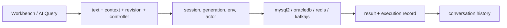

# DSH Database

[](LICENSE)
[](cordis.patch.yml)
[](https://github.com/zhuoxiaoshuai/dsh-database)

MySQL, Oracle, Redis, and Kafka in a DeepSeek Harness tab. You and the model use the same connections, the same editor, the same runs, and the same history.

🌐 **English** | [中文](README.zh.md)

Version **0.1.0-alpha.12.15**. Tests against throwaway containers are not a production claim.

```sh
npm pack
dsh plugin --profile web add ./dsh-database-0.1.0-alpha.12.15.tgz
```

Uninstall: `dsh plugin --profile web remove dsh-database`. That returns stock `dsh web`; do not also paste the same row into the profile patch. Desktop bundles `dsh` but does not put it on PATH — open **DSH Terminal** from the tray and use `--profile desktop`.

> [!IMPORTANT]
> On **SIT**, query cells go to the model unredacted. UAT / PVT block AI writes and grid DML. The human SQL page still auto-commits in every environment (`lane: manual`). A saved connection is that account running in the Host process. [SECURITY.md](SECURITY.md).

## Data

Tag the environment before the first query. UAT / PVT does not hide cells you already sent on SIT.

| | |
| --- | --- |
| Passwords, custom CAs | Host only. Stripped from snapshots, logs, history, and model output. Encrypted remember-password is Windows DPAPI (stdin, CurrentUser). Off by default; not available on other OS |
| SIT query cells | Sent to the model as-is |
| UAT / PVT query cells | AI cannot write. Tool results go through `redactQueryResult` (joins and `SELECT *` drop cells; a simple single-table column list can still pass unless you add column rules) |
| SQL editor writes | Auto-commit in every environment (`lane: manual`). The database user is the actual permission |
| Grid DML / DDL / AI `database_execute_sql` writes | SIT only |
| `redis_execute` | SIT only. Console: one CLI-quoted command on its own connection, then close |
| Kafka peek | Group `dsh-peek-{uuid}`, `autoCommit: false`, no offset commit. GROUPS hides those ids |
| BIGINT / NUMBER | String at the driver (`bigNumberStrings` / `fetchTypeHandler`) |
| BLOB | `[BLOB n bytes]`, not a dumped buffer |

## What it does

One Database tab: catalog on the left; overview, query, AI Query, knowledge, and history on the right. Four sources share that chrome. Redis stays SCAN + a command console. Kafka peek does not join a business consumer group.

Typing in AI Query takes control (`controller: user`) until you hand it back. mysql2, oracledb, redis, and kafkajs load only in Host workers; the browser talks authenticated `/plugins/database/...`.

This is not a chart / NL-report plugin and not a second Navicat. No PostgreSQL, ClickHouse, MongoDB, or Elasticsearch in this package.

New sources should copy Kafka (`standard` + `standard-text`), not clone MySQL.

## Screenshots

Current UI. Names and rows are fixtures.

<p align="center">
  
</p>

*MySQL, Oracle, Redis, Kafka on the left. Kafka topics on the right.*

<p align="center">
  
</p>

*Partitions, replica factor, leader, watermarks. Peek uses a temporary consumer.*

<p align="center">
  
</p>

*SCAN tree, type, TTL, value. The command console is another connection, so `SELECT` / `MULTI` do not stick on the browser.*

<p align="center">
  
</p>

*BIGINT and exact decimals as strings. Cells are not executed as HTML.*

<p align="center">
  
</p>

*Schema tree (case-insensitive). Same SQL workbench as MySQL; Service Name / SID and types are Oracle.*

## Quick start

Needs a working `dsh web` and Node.js ≥ 24. After `npm pack` and `dsh plugin add` (above), restart the Web Profile. Open **Database**, add a connection, Test, then Connect. A failed edit keeps the previous live session.

Once connected:

```sql
SELECT 9007199254740993 AS too_big_for_js;
```

```text
PING
```

```text
PEEK "orders" PARTITION 0 FROM LATEST LIMIT 20
```

Replace `"orders"` with a topic you can see. History is per conversation. Harness versions we ran: `0.1.2-rc.1`, `0.1.7-rc.2`, `0.2.0-rc.2`. Live Desktop GUI and real model `callId` correlation have not been run.

After npm publish: `dsh plugin --profile web add dsh-database`.

## Sources

| Source | Typical use | Result |
| --- | --- | --- |
| MySQL | Catalog, SQL | Grid, `SHOW CREATE` |
| Oracle | Same, Service / SID schema | `OFFSET FETCH` grid |
| Redis | Keys, one command | SCAN, type, TTL, value |
| Kafka | Topic inspect | Partitions, watermarks, peek |

### MySQL

Objects: database → table → column. Backticks. `LIMIT … OFFSET …`. System schemas stay visible. Defaults: `VARCHAR(255)` / `BIGINT`. Driver `mysql2`, port 3306.

Catalog: tree, search, columns / indexes / constraints, `SHOW CREATE` when the account can read it. Missing access is reported, not shown as empty.

Query: editor, format, cancel (login stays). SELECT filter / sort / page on the server. Default 100 rows, cap 500 rows and 1 MiB, 30 s. Grid DML: parameterized, preview, one confirm, PK locate and original-row check; conflict rolls back and keeps the draft. DDL: up to 20 steps, 5-minute one-shot approval, type the destructive name in the same window; first error stops; no whole-DDL rollback. InnoDB lock-wait checked on throwaway 8.4.

AI: `database_execute_sql`, SIT up to 8 statements (100 rows each, DML allowed), stop on first error.

### Oracle

Same SQL workbench, different dialect. Schema is case-insensitive; default schema is the username when it exists. Identifiers use `"`. `OFFSET … ROWS FETCH FIRST … ROWS ONLY`. `EXPLAIN PLAN FOR`. q-quotes yes, `#` comments no. Driver `oracledb`, port 1521, Thin mode. SID unverified.

Column comments are a separate dictionary. Defaults: `VARCHAR2(255)` / `NUMBER(19)`. Views and synonyms: metadata only. LOB columns in a query are unsupported. 19c, SID, and temporal-column maintenance unverified. Free 23 Thin is not a stand-in for 19c.

### Redis

Not SQL. DB → Key, plus type and TTL. A page is a SCAN cursor (empty pages and duplicates happen; the UI dedupes and says when SCAN is unfinished). Redis 7.2+.

Standalone, one sentinel, or one cluster seed. Optional ACL, TLS, custom CA. Sentinel: one address for the master; user/password apply to both. Cluster: host is a seed, DB is 0.

Command console: one Redis-CLI-quoted command, then close. Key browser: String / Hash / List / Set / ZSet / TTL, paged large collections, set/remove TTL, delete, edit basic values. Binary as Base64. `DSH_REDIS_COMMAND_BLACKLIST` default empty; ACL still applies. `redis_execute` is SIT-only. Cluster / Sentinel against production clusters unverified.

### Kafka

Read-only. Topic / partition / existing group. Peek is one partition, bounded. Auth: none, TLS + custom CA, SASL PLAIN, SCRAM-SHA-256 / 512. PLAIN/SCRAM may skip TLS; if TLS is on, certificates are verified. No Kerberos, OAuth, or client certs. No produce, topic create/delete, config change, or offset move.

Client `standard`, host `standard-text`. Copy this for a new source.

## Tools

Same path as the tab. Call guides load on demand (`database_status` + topic), not every turn.

| Tool | |
| --- | --- |
| `database_status` | Live SQL/Redis connections and `generation`. Optional topic loads a guide |
| `database_catalog` | `schemas` / `tables` / `table`. Do not use `information_schema` via SQL. Missing access is `unavailable` |
| `database_execute_sql` | `action=read` returns the AI Query text. With `sql`: SIT, up to 8 statements, 100 rows each, stop on first error. This tool is read-only on UAT/PVT |
| `database_templates` | Knowledge. Save does not run SQL |
| `database_read_collab` | Query tabs. `lastRun` is columns, row count, elapsed |
| `database_import_connections` | Register hosts without password. Login in the workbench |
| `redis_status` / `redis_keys` / `redis_value` | SCAN (empty pages happen), type, TTL, paged value |
| `redis_execute` | SIT only. One command, isolated connection |
| `kafka_status` / `kafka_topics` / `kafka_describe` | Visible topics, partitions, leader, watermarks |
| `kafka_peek` | One partition. Writes the command into the shared document first; refused if you already took over |

## How it works

Workbench and AI Query edit a document (`text`, `context`, `revision`, `controller`). Host `ConnectionService` checks session, connection `generation`, environment, and actor (`user` or `ai` — the browser cannot mint `ai`). The source module turns text into a worker action; runtime checks a whitelist. Kafka only allows the read actions it parsed.



Connections live in the workspace file. Query tabs and AI documents are per conversation. Reconnect bumps `generation` and drops in-flight work.

Redis and Kafka store `ExecutionDocument`. MySQL and Oracle still use `SharedQuery` on the same AI Query tab (same takeover rules). `SourceWorkspace` is overview / query / AI Query / knowledge; a source supplies Editor, Result, `runText`, and tree bindings.

`updateExecutionDocument` rejects AI writes when `controller !== 'ai'`. First keystroke is `saveDraft(..., takeControl=true)` → `controller: user`. Hand-back is `return-ai` and needs a saved document. `runExecutionDocument` requires `controller === 'user'` and a matching `revision`. Redis DB is part of `context`; changing it bumps revision, keeps controller, and cancels the old request scope.

`peekKafkaPartition`: `dsh-peek-{uuid}`, `autoCommit: false`, seek one partition, `stop` / `disconnect`. Cleanup timeout recycles the worker (`recycleWorker`). `visibleGroupIds` hides `dsh-peek-` names.

MySQL catalog / maintenance / query connections set `supportBigNumbers` and `bigNumberStrings`. Oracle query uses `oracleFetchTypeHandler` so NUMBER and timestamps arrive as STRING. `formatFetchedValue` turns Buffer into `[BLOB n bytes]`. Grid cells are not HTML.

`normalizeEnvironment`: `dev` / `test` → SIT; `staging` → UAT; `prod` → PVT; anything else → UAT. Grid maintenance is SIT-only.

One execution record per run: success, failure, cancel, empty, partial, or **unknown**. Unknown means a timed-out write may already have hit the server; the UI does not claim rollback. Default deadline 30 s for peek and query.

| Shared | Per source |
| --- | --- |
| Tab, connect, DPAPI, conversation isolation | host/port vs Service/SID vs SASL vs Redis mode |
| Loading / error / empty, result frame | tree shape |
| Execution id, cancel, history | `LIMIT`, SCAN cursor, peek offset |
| AI Query, takeover, revision | command language, authorize |
| `knowledge.json` (human confirm) | fingerprint / analysis |

| Source | Client | Host |
| --- | --- | --- |
| MySQL | `legacy-sql` | `legacy-adapter` |
| Oracle | `legacy-sql` | `legacy-adapter` |
| Redis | `standard` | `legacy-adapter` |
| Kafka | `standard` | `standard-text` |

Knowledge save does not execute. Trial run uses the same authorize path. Old `sql-templates.json` is read once into `knowledge.json`.

More detail: [docs/README.md](docs/README.md), [architecture](docs/data-source-architecture.md), [onboarding](docs/data-source-onboarding.md).

## Limits

| Environment | Human | AI |
| --- | --- | --- |
| SIT | Account permissions; grid DML/DDL | Unredacted cells; DML; `redis_execute` |
| UAT / PVT | SQL editor can still write (auto-commit); grid DML blocked | No writes; no Redis execute |
| DDL | Confirm | Not auto-run |

| | |
| --- | --- |
| Node.js | ≥ 24; isolated loads use Desktop's bundled Node |
| Harness | `0.1.2-rc.1`, `0.1.7-rc.2`, `0.2.0-rc.2` |
| MySQL | 8.4.x throwaway; 8.0.32 read-only check |
| Oracle | Free 23 Thin; not 19c / SID |
| Redis | 8.10.2 throwaway |
| Drivers | mysql2 3.24.4, oracledb 7.0.1, redis 6.2.1, kafkajs 2.2.4 |

Not claimed: Oracle LOB queries; Oracle 19c / SID / temporal maintenance; Redis Cluster / Sentinel on a business cluster; Kafka produce / Kerberos / OAuth / client certs; PostgreSQL / ClickHouse / Mongo / ES / charts; live Desktop GUI and real `callId` correlation.

## Troubleshooting

| Problem | |
| --- | --- |
| `/plugins/database/connections` collision | Uninstall an older remote-exec that still embeds this workbench. This plugin can sit beside current `dsh-remote-exec` |
| Desktop: `dsh` not found | DSH Terminal from the tray |
| Plugin missing after add | Restart the Web Profile, refresh, do not duplicate `cordis.patch.yml` |
| Oracle query hits LOB columns | Unsupported |
| Console `SELECT` does not change the key tree | Expected; pick the DB in the tree |
| Peek and business consumers | Peek does not join them |

## FAQ

**Does the model see passwords?** No. They are stripped from snapshots, logs, history, and model output. Windows remember-password does not round-trip to the browser.

**Does the model see rows?** On SIT, yes. UAT / PVT stop AI writes and grid DML; the SQL editor can still commit. Use a database user that matches what you want done.

**Navicat?** No. Catalog and query next to the chat. Heavy DBA work stays in a dedicated client.

**PostgreSQL / Mongo / ES?** Not in this package. Copy Kafka's `standard` + `standard-text` module if you add one. Do not clone MySQL.

**Peek disconnect is slow?** Worker `stop` / `disconnect` with a timeout; failure recycles the worker.

## Development

```sh
npm ci --legacy-peer-deps
npm run check
```

Live-database scripts create uniquely labelled Docker containers and delete them. Do not point them at business databases.

```sh
npm run test:mysql
npm run test:oracle
DSH_TEST_REDIS=1 npm run test:host
DSH_TEST_DATABASES=1 npm run test:host
```

Isolated host: `DSH_DESKTOP_APP=... npm run test:host`. `DSH_TEST_ALLOW_VERSION` is diagnostic only.

Issues: [GitHub Issues](https://github.com/zhuoxiaoshuai/dsh-database/issues). Vulnerabilities: [SECURITY.md](SECURITY.md), privately.

After the repo is at least a day old, list it on [awesome-dsh-plugin](https://github.com/awesome-dsh-plugin/awesome-dsh-plugin) as `data/plugins/zhuoxiaoshuai__dsh-database.yml` (topic `dsh-plugin` is set):

```yaml
url: https://github.com/zhuoxiaoshuai/dsh-database
name: zhuoxiaoshuai/dsh-database
category: dev
description:
  en: MySQL, Oracle, Redis, and Kafka workbench for DeepSeek Harness, with a shared execution path for humans and the model.
  zh: DeepSeek Harness 的 MySQL、Oracle、Redis、Kafka 工作台，人和模型共用同一套连接、执行和记录。
```

## License

[MIT](LICENSE)
