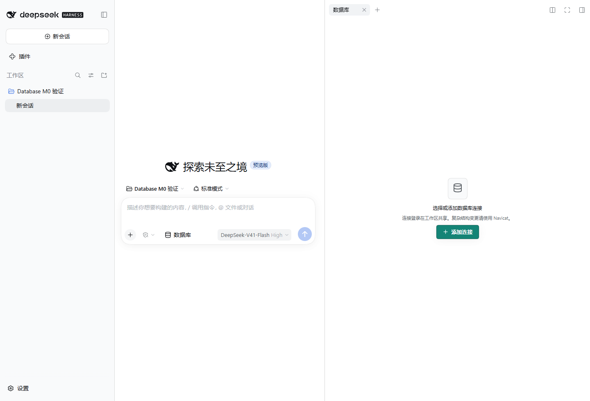
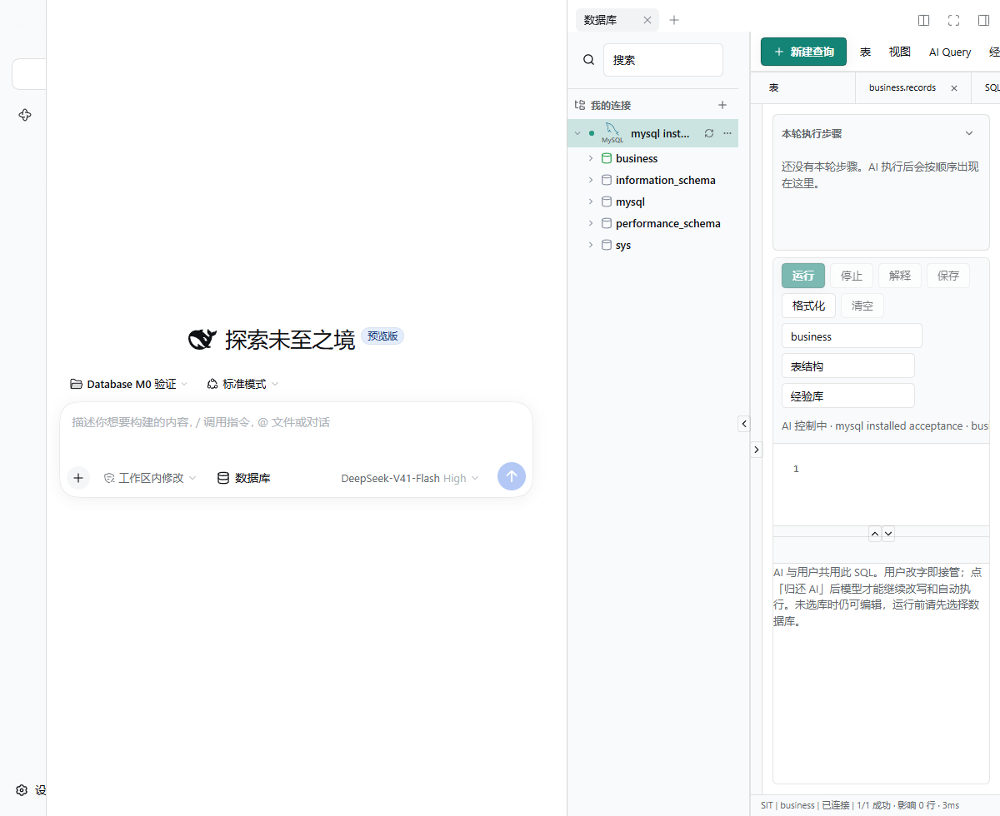
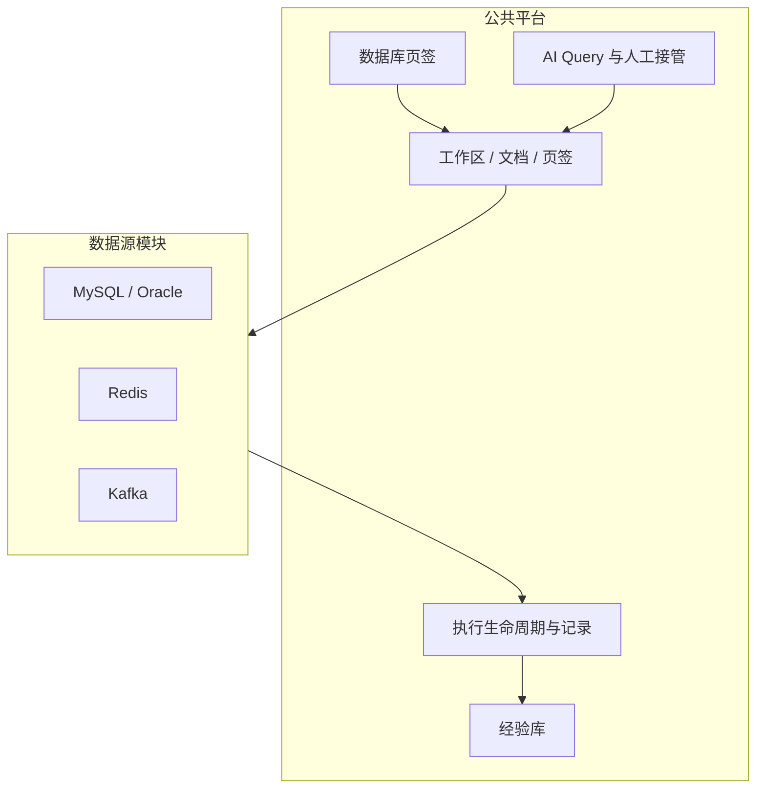

# dsh-database

<div align="center">
  🌏 <a href="./README.md">English</a> · <a href="./README.zh.md"><b>中文</b></a>
</div>

<br />

[](LICENSE)
[](https://github.com/zhuoxiaoshuai/dsh-database)
[](README.md)

DeepSeek Harness 的 MySQL、Oracle、Redis、Kafka 工作台。人和模型共用连接、文档、执行、结果和记录。

当前版本 **0.1.0-alpha.12.15**。

<p align="center">
  
</p>

<p align="center"><sub>插件在会话旁注册「<b>数据库</b>」页签。连接按工作区保存，查询工作台按对话隔离。</sub></p>

## 亮点

- **一个工作台，四种数据源。** MySQL、Oracle、Redis、Kafka 进同一个右侧栏页签。加一种源是登记真实差异，不是再复制一套产品。
- **人和模型走同一条路。** 正式 AI 入口是工作台里的 **AI Query**。人改过的内容模型接着执行；模型跑过的内容人可以打开、接管、继续改。
- **执行为一等对象。** 每次运行有身份、代次、取消、超时、历史，以及成功 / 失败 / 取消 / 空 / 未知的诚实结果。
- **环境是闸，不是标签。** SIT 可写。UAT / PVT 对 AI 和类生产连接只读。DDL 仍须人工确认。
- **秘密留在 Host。** 密码和自定义 CA 不回连接快照、日志、查询历史或模型输出。Windows 勾选记住密码时用当前用户 DPAPI。
- **不强行统一语义。** Redis 不是 SQL。Kafka peek 不加入业务消费组、不提交 offset。分页、游标、结果形状跟数据源走。

## 截图

来自隔离 DSH Web profile、已安装插件、一次性 Docker 夹具（MySQL 8.4 / Oracle Free 23），不是业务集群。

| 会话旁的数据库页签 | MySQL 目录、SQL、AI Query |
| --- | --- |
|  |  |

| 结果网格（精确小数按字符串） | Oracle 目录 |
| --- | --- |
|  |  |

## 能做什么

### 连接

- 同一套表单外壳添加 MySQL、Oracle、Redis、Kafka。方言字段（Service Name / SID、Redis DB / ACL / TLS、Kafka SASL）留在各源。
- 先测试再连接。编辑失败保留原来的活动会话。
- 工作区列表：`$DSH_HOME/database/database-workspace.json`。查询页签、草稿、历史：按对话的 `conversation-workbenches/`。
- 「记住密码」默认不勾。勾选后（Windows）只给当前系统用户 DPAPI 加密。
- 连接上选择 SIT / UAT / PVT。类生产连接在工作台保持只读。

### MySQL / Oracle

- 目录树：库 / Schema、表、搜索。对象页展示字段、索引、约束，以及账号有权读取的建表原文。读不到的信息给原因，不当作零。
- SQL 编辑器：格式化、取消（不断开共享登录）、对话私有历史、工作区共享经验库（标准化、相似合并建议、人工发布）。
- SELECT 走库端筛选排序分页。默认 100 行，最多 500 行、1 MiB，单请求 30 秒。
- 受控 DML：增改删生成参数化语句，预览后一次确认，主键定位并核对原记录。冲突回滚并保留草稿。
- 受控 DDL：建表、字段、索引、注释、重命名、清空/删除，最多 20 步，审批 5 分钟一次消费。破坏性操作在同一窗口填写目标名。首错停止，不承诺 DDL 整体回滚。
- 大整数和精确小数按字符串展示。结果不作为 HTML 执行。

### Redis 7.2+

- 单机、一台哨兵或一个集群种子。可选 ACL、TLS、自定义 CA。哨兵用一个地址问主库；用户名密码同时用于哨兵和 Redis。集群把主机当种子，DB 固定 0。
- 命令台每次一条，按 Redis CLI 引号解析，不经 Shell。每次命令独立连接，结束即关，`SELECT` / `AUTH` / `MULTI` 不会留在 Key 浏览连接上。
- Key 浏览用 `SCAN`（可能空页和重复；界面去重并提示尚未扫完）。String / Hash / List / Set / ZSet / TTL，大集合分页，设/删 TTL，删除，编辑基础值。二进制显示 Base64。
- Host 命令黑名单默认空，可用 `DSH_REDIS_COMMAND_BLACKLIST`。UAT/PVT 的 AI 不能调用 `redis_execute`。

### Kafka

- 列出 Topic、查看 Topic / 分区、对单个分区有界 peek。
- 不发消息、不建删 Topic、不改配置、不提交消费位置。peek 不加入业务消费组。
- 认证：无认证、TLS、自定义 CA、SASL PLAIN、SCRAM-SHA-256 / 512。PLAIN/SCRAM 可不启用 TLS；启用 TLS 时必须验证书（可自定义 CA，不提供跳过验证）。
- Kerberos、OAuth、客户端证书不在范围内。

### AI 与接管

- 入口是工作台 **AI Query**，不是另一套 Agent 控制台。
- SIT：单元格原值给模型；`database_execute_sql` 一次最多 8 条（每条 100 行），可含 INSERT/UPDATE/DELETE，首错停止。
- UAT / PVT：AI 禁写。Redis 只保留 status / keys / 读值工具。
- 点执行历史即打开将执行或已执行的文档。其他连接上的 AI 活动只出提示条，不抢当前连接。
- 人在编辑器里输入即接管，模型停止写入该文档。交还后模型才能继续。

### 经验库

SQL 经验与 Redis 知识写入同一份 `knowledge.json`（首次仍可读旧 `sql-templates.json`）。指纹和保存校验按源实现。发布要人工确认。

## 架构

这是一套**统一数据源工作平台**，不是四个迷你 IDE。Workspace、AI 协作、接管、执行生命周期、History、Knowledge、页面外框只实现一次。数据源只实现真正不同的部分：连接协议、对象模型、命令语言、授权、结果结构、补全、AI 转换。



| 层 | 负责 | 不负责 |
| --- | --- | --- |
| 平台 | 流程、生命周期、对话隔离、修订、取消、历史、公共外框 | host/port 字段长什么样、SQL vs RESP vs peek、SCAN 怎么翻页 |
| 数据源模块 | 驱动/Worker、校验/指纹、对象、授权、结果投影、补全 | 第二套 AI 页、第二套 History、再抄一份 Toolbar |

Driver 只在 Host Worker 里加载，浏览器不加载。SQL 的批量/维护/网格仍走兼容适配；Redis/Kafka 走标准工作台绑定。新源应按 standard + standard-text 接入，不要复制 MySQL。

更细的说明：[docs/README.md](docs/README.md)、[架构](docs/data-source-architecture.md)、[接入指南](docs/data-source-onboarding.md)。

## 一直守着的设计

1. **同一业务状态一个权威来源。** 可以有只读投影，不能有两份可独立改的副本。
2. **AI 和人是同一条流水线。** 不为某个方言再做一套 Agent 工作台。
3. **失败要可见。** 取消、超时、空、部分、未知分开说。维护超时可能让库端状态未知——界面如实写。
4. **不为了代码整齐去统一 Kafka offset 和 Redis SCAN。** 统一的是用户怎么走完这条路。
5. **拿掉一种数据源，平台仍然成立。** 加一种源，原则上不改 MySQL 的业务实现。

## 环境策略

| 环境 | 人工 | AI |
| --- | --- | --- |
| SIT | 跟账号权限 | 单元格原值；允许 DML；允许 Redis `redis_execute` |
| UAT / PVT | 类生产连接只读 | 禁写；拒绝 Redis execute |
| DDL | 人工确认 | 不自动跑 |

详见 [SECURITY.md](SECURITY.md)。

## 安装

需要已能运行的 DSH（`dsh web`），Node.js ≥ 24。

```sh
npm pack
dsh plugin --profile web add ./dsh-database-0.1.0-alpha.12.15.tgz
```

装到 npm 之后：

```sh
dsh plugin --profile web add dsh-database
```

安装由包内 `cordis.patch.yml` 挂载。不要再往 profile patch 手写同一行。卸载：`dsh plugin --profile web remove dsh-database`。

不要同时安装旧的「内嵌数据库的 remote-exec」，二者都会占用 `/plugins/database/connections`。本插件与 `dsh-remote-exec` 可以并存。

## 限制

- 视图、同义词可看元数据；含 LOB 的 Oracle 查询暂不支持。
- Oracle 19c、SID、时间字段维护未验收。
- Redis Cluster / Sentinel、真实业务集群未验收。
- Kafka 不发消息、不改 offset，不支持 Kerberos / OAuth / 客户端证书。
- 现用 Desktop GUI 与真实模型 callId 关联仍为未跑。隔离 profile 的证据不能当成生产声明。

| 环境 | 说明 |
| --- | --- |
| Node.js | ≥ 24；隔离加载用 Desktop 内置 Node |
| Harness | 已验证 `0.1.2-rc.1`、`0.1.7-rc.2`、`0.2.0-rc.2` |
| MySQL | 8.4.x 临时容器；8.0.32 仅只读核对 |
| Oracle | Free 23 Thin 模式，不替代 19c/SID |
| Redis | 8.10.2 一次性容器 |
| 驱动 | mysql2 3.24.4、oracledb 7.0.1、redis 6.2.1、kafkajs 2.2.4 |

## 开发

```sh
npm ci --legacy-peer-deps
npm run check
```

实库脚本会创建带唯一标签的临时 Docker 容器并删除。不要对着业务库跑。

```sh
npm run test:mysql
npm run test:oracle
DSH_TEST_REDIS=1 npm run test:host
DSH_TEST_DATABASES=1 npm run test:host
```

设置 `DSH_DESKTOP_APP` 为 Desktop 安装根目录，再 `npm run install:desktop`（只交 tgz，不链源码）。隔离宿主：`DSH_DESKTOP_APP=... npm run test:host`。`DSH_TEST_ALLOW_VERSION` 仅用于诊断。

## 目录收录

仓库创建满一天后，向 [awesome-dsh-plugin](https://github.com/awesome-dsh-plugin/awesome-dsh-plugin) 提交 `data/plugins/zhuoxiaoshuai__dsh-database.yml`：

```yaml
url: https://github.com/zhuoxiaoshuai/dsh-database
name: zhuoxiaoshuai/dsh-database
category: dev
description:
  en: MySQL, Oracle, Redis, and Kafka workbench for DeepSeek Harness, with a shared execution path for humans and the model.
  zh: DeepSeek Harness 的 MySQL、Oracle、Redis、Kafka 工作台，人和模型共用同一套连接、执行和记录。
```

GitHub Topics 已包含 `dsh-plugin`。

## License

MIT
