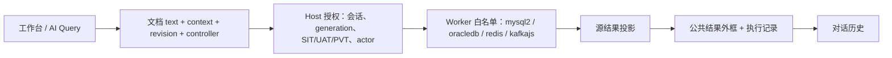
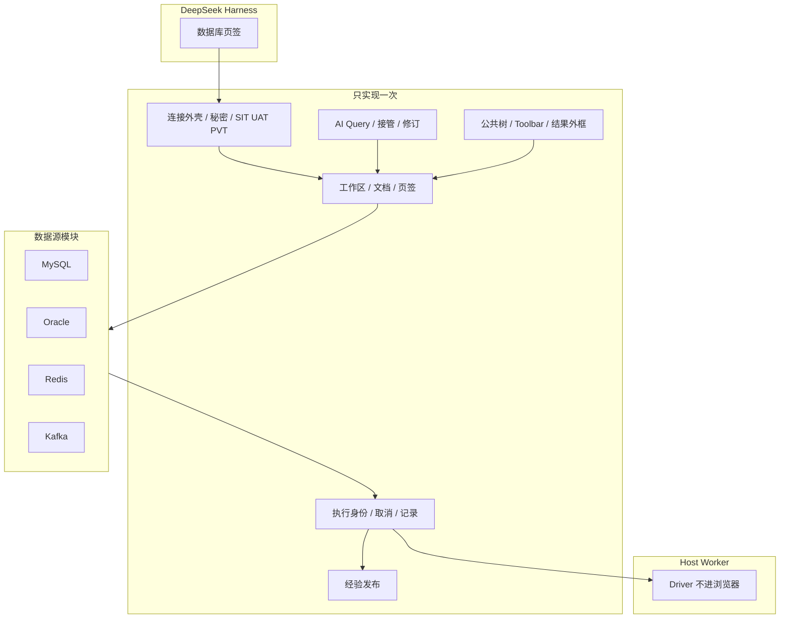

# DSH Database

[](LICENSE)
[](cordis.patch.yml)
[](https://github.com/zhuoxiaoshuai/dsh-database)

**DeepSeek Harness 的 MySQL、Oracle、Redis、Kafka 工作台：人和模型共用连接、文档、执行、结果和记录。**

🚀 一个「数据库」页签 ｜ 四种源 ｜ 同一条执行路

[为什么存在](#为什么存在) ｜ [怎么比](#和其他做法比) ｜ [亮点](#亮点) ｜ [先试试](#先试试) ｜ [实际效果](#实际效果) ｜ [快速开始](#快速开始三步完成) ｜ [数据源](#数据源) ｜ [模型会调什么](#模型会调什么) ｜ [工作原理](#工作原理) ｜ [限制](#配置与限制)

🌐 [English](README.md) ｜ **中文**

当前版本 **0.1.0-alpha.12.15**。隔离 profile 的证据不能当成生产声明。

```sh
npm pack
dsh plugin --profile web add ./dsh-database-0.1.0-alpha.12.15.tgz
```

卸载回到官方 `dsh web`，不留核心补丁：`dsh plugin --profile web remove dsh-database`。桌面版从托盘打开 **DSH 终端**（不把 `dsh` 写入 PATH），使用 `--profile desktop`。

> 如果这个插件有用，点个 Star 方便其他 DSH 用户找到。

> [!IMPORTANT]
> **SIT 会把查询单元格原值送给模型。** UAT / PVT 拒绝 **AI** 写入和网格 DML；人工 SQL 页在所有环境仍可自动提交（`lane: manual`）。密码不会回到浏览器快照。每条已保存连接都等于把该账号交给 Host 进程。详见 [SECURITY.md](SECURITY.md)。

## 为什么存在

DeepSeek Harness 已经在会话旁边推理。常见摸库方式却把这条路打断：

- **把 SQL 贴进对话。** 模型看见（或编造）连接串，打不开目录，取消不干净，还会覆盖你正在改的文本。
- **交给「对话里写 SQL」的 Agent。** 自然语言变成 SQL（常常还有图）出现在对话里。适合出报告。不适合当工作台：你接管不了同一份编辑器，Redis/Kafka 被塞进二维表，peek 还可能进真实消费组。
- **旁边开着 Navicat。** 模型是瞎的。你截网格图。没有共用历史。
- **做成四个小插件。** 每个都抄一套 AI Query 和历史。Redis 被假扮成 SQL。Kafka peek 悄悄进了业务消费组。

这个插件在会话里放**一个「数据库」页签**。人和模型共用同一条连接、同一份文档、同一次执行记录、同一份结果。Redis 还是 Redis。Kafka peek 用一次性 `dsh-peek-*` 组、`autoCommit: false`，不提交 offset。

社区里 star 高的插件卖的是**边界**，不是功能清单。[Vision Toolkit](https://github.com/Anionex/dsh-vision-toolkit) 把像素和本地图像工作留在 Agent 的一侧。[dsh-context](https://github.com/bowenliang123/dsh-context) 回答「当前窗口里到底有什么」。数据库插件对数据源做同样的事：**Driver 和秘密留在 Host，文档留在工作台，原生语义留在各源模块。**

## 和其他做法比

| | 贴进对话 | 对话里写 SQL 的 Agent | 外部 IDE | 这个插件 |
| --- | --- | --- | --- | --- |
| 模型能否跑你看见的内容 | 只有贴出去才行 | 工具调用里另有一份影子语句 | 不能 | **AI Query** 就是那份文档 |
| 人能否接管 | 和下一个 token 打架 | 改下一句提示词 | 无 | 一打字 `controller: user`，AI 不能覆盖 |
| Redis / Kafka | 假装是 SQL | 通常不在范围内 | 另买工具 | SCAN 游标 / 有界 peek |
| 图表 / 自然语言报告 | 截图 | 常常有 | 专用 BI | **不是这个插件** — 工作台里给准确单元格 |
| 秘密 | 经常进上下文 | 环境变量 / 设置页 | 本地文件 | 只在 Host；Windows DPAPI；快照里剥掉 |
| 环境 | 无 | 按源只读开关 | 无 | SIT：AI + 网格可写；UAT·PVT：拦 AI/网格，人工 SQL 页仍可写 |
| 取消 / 超时 / 未知 | 看聊天状态 | 看工具 | 看工具 | 执行状态是一等对象 |

**一句话：** 不是 SQL 聊天机器人，也不是第二套 Navicat。是会话旁的工作台，模型是同一条路上的同事。

社区里「对话写 SQL」类插件（例如 [tomowang/dsh-data-agent](https://github.com/tomowang/dsh-data-agent)）适合 **自然语言 → SQL → 对话里出图**。这个插件适合 **共用工作台**：目录、原生 Redis/Kafka 页、输入即接管、Driver 留在 Host。PostgreSQL、ClickHouse、柱状/折线/饼图不在本包。

## 亮点

- **按你本来的方式打开表。** 左目录，右页签（总览 / 查询 / **AI Query** / 经验 / 历史）。四种源，一套外框。
- **模型跑的是你看见的那份。** 点历史即打开当时那份文本。其他连接上的活动只出提示条，不抢当前连接。
- **输入即接管。** 第一下按键就让模型不能再覆盖编辑器，直到你交还。运行还核对 revision，过期页签打不出去。
- **浏览器不加载 Driver。** mysql2、oracledb、redis、kafkajs 只在 Host Worker 里。客户端走带认证的插件 HTTP。
- **环境是闸，不是徽章。** SIT：AI 可 DML / `redis_execute`。UAT / PVT：拦 AI 和网格 DML；人工 SQL 页仍可写。DDL 人工闸。真正权限是数据库账号。
- **分页跟源走，单元格说实话。** SQL 用 `LIMIT` / `OFFSET FETCH`。Redis SCAN 空页就是空页（界面会说）。Kafka peek 不提交 offset。BIGINT 在 Driver 就是字符串。BLOB 是 `[BLOB n bytes]`。
- **秘密留在 Host。** 「记住密码」默认关。加密记住密码只在 Windows（当前用户 DPAPI，密钥走 stdin 不走命令行）。自定义 CA 同样剥离。

本项目两层：

1. **抽出的工作台** — Workspace、AI Query、接管、执行、History、Knowledge、外框。一次。
2. **数据源模块** — 协议、对象、授权、结果形状。现在四个；新源应抄 Kafka（`standard` + `standard-text`），不要克隆 MySQL。

**目录**

- [为什么存在](#为什么存在)
- [和其他做法比](#和其他做法比)
- [亮点](#亮点)
- [适合谁用](#适合谁用)
- [先试试](#先试试)
- [实际效果](#实际效果)
- [快速开始：三步完成](#快速开始三步完成)
- [数据源](#数据源)
- [模型会调什么](#模型会调什么)
- [工作原理](#工作原理)
- [配置与限制](#配置与限制)
- [常见问题](#常见问题)
- [还想知道的](#还想知道的)
- [开发与社区](#开发与社区)

## 适合谁用

1. 已经泡在 DeepSeek Harness 里，希望 MySQL / Oracle / Redis / Kafka **就在会话旁边**，而不是模型看不见的另一个窗口。
2. 希望模型和人跑**同一份** SQL、Redis 命令或 Kafka peek：能打开、改、接管，而不是再做一套 Agent 控制台。
3. 在意 peek 不进业务消费组、Redis `MULTI` 不粘在 Key 浏览上、以及 `9007199254740993` 不会变成 `9007199254740992`。

## 先试试

连接活着之后，在对话里这样说。SQL、命令或 peek 会落到 **AI Query**，你可以改、可以接管。

| 你说 | 实际会发生什么 |
| --- | --- |
| 看一下表 `orders`，最新 20 行 | 目录走 `database_catalog`（不用 `information_schema`）。SQL 走 `database_execute_sql`。再次跑之前你可以改 `LIMIT`。 |
| 模型写出了 `DELETE` — 停下，我来改 | 第一下按键就把 `controller` 设成 `user`。交还之前 AI 再发布会被拒绝。 |
| Redis Key `user:42` 是什么类型、TTL 多少？ | `redis_value` 走 SCAN 那条连接。命令台是**另一条** socket，所以 `SELECT` / `MULTI` 不会留在浏览上。 |
| Peek Topic `orders` 分区 0，最新 20 条 | `kafka_peek` 创建 `dsh-peek-{uuid}`，`autoCommit: false`，seek 一个分区然后断开。不会加入 `billing`。 |
| 把这条 SQL 存进经验库 | `database_templates` 只存文本。保存不执行。以后跑仍走同一条授权。 |

## 实际效果

### 四个源，一棵树

<p align="center">
  
</p>

*左：MySQL、Oracle、Redis、Kafka 连接。右：Kafka Topics。查询页签、AI Query、经验库是同一套外框。*

> 提示词示例：「列出这个 Kafka 连接上的 Topic，然后描述 `orders`。」

### Kafka Topic 元数据

<p align="center">
  
</p>

*分区、副本因子、Leader、水位。Peek 用临时消费者，不加入业务消费组、不提交 offset。*

> 提示词示例：「从最新 offset peek `orders` 分区 0，最多 20 条。不要加入 billing 消费组。」

### Redis Key 和值

<p align="center">
  
</p>

*SCAN 树、类型、TTL、JSON 值。命令台是另一个页签、另一条连接，所以 `SELECT` / `AUTH` / `MULTI` 不会留在浏览连接上。*

> 提示词示例：「`user:42` 是什么类型、TTL 多少？然后在命令台 GET。」

### MySQL 结果网格

<p align="center">
  
</p>

*BIGINT 和精确小数按字符串展示。单元格不当 HTML 执行。*

> 提示词示例：「从 `orders` 取最新 20 行。BIGINT 保持文本。」

### Oracle 目录

<p align="center">
  
</p>

*Schema 树（大小写不敏感）。和 MySQL 同一套 SQL 工作台；Service Name / SID、分页、类型跟 Oracle。*

> 提示词示例：「打开 Schema `HR`，描述 `EMPLOYEES`。不要查 `information_schema`。」

截图是当前工作台。连接名和样例行是一次性夹具，不是业务集群。

## 快速开始：三步完成

### 1. 安装

需要已能运行的 DSH（`dsh web`），Node.js ≥ 24。

```sh
npm pack
dsh plugin --profile web add ./dsh-database-0.1.0-alpha.12.15.tgz
```

装到 npm 之后：

```sh
dsh plugin --profile web add dsh-database
```

使用 **DSH Desktop 桌面版**？桌面版自带 `dsh`，但有意不写入系统 PATH。请从托盘打开 **DSH 终端**：

```sh
dsh plugin --profile desktop add ./dsh-database-0.1.0-alpha.12.15.tgz
```

然后重启 Desktop。`npm run install:desktop` 会把 tarball 装进 profile（设置 `DSH_DESKTOP_APP` 为安装根目录，不链源码）。

安装由包内 `cordis.patch.yml` 挂载。不要再往 profile patch 手写同一行。卸载：`dsh plugin --profile web remove dsh-database`。

### 2. 重启并打开页签

重启正在运行的 Web Profile。在会话里打开「**数据库**」页签，添加连接，先 **测试** 再 **连接**。编辑失败会保留原来的活动会话。

### 3. 跑一条人能接管的操作

- MySQL / Oracle：打开一张表或跑 SQL。历史按对话隔离。
- Redis：选一个 DB，浏览 Key，或在命令台跑一条命令。
- Kafka：打开 Topic，再对一个分区做有界 peek。

模型和人用同一份文档。人一打字就接管。

## 数据源

各源复用上面的工作台。表是地图，下面各章只写真实差异。

| 源 | 最适合问的问题 | 主要结果 |
| --- | --- | --- |
| MySQL | 这个库 / 表里有什么？跑这条 SQL。 | 目录、`SHOW CREATE`、结果网格 |
| Oracle | 一样，对着 Service / SID 的 Schema | Schema 树、`OFFSET FETCH` 网格 |
| Redis | 这个 Key 是什么？跑这条命令。 | SCAN 树、类型、TTL、值 |
| Kafka | 这个 Topic 上有什么？ | 分区、水位、有界 peek |

### MySQL

关系型 SQL。对象：**数据库 → 表 → 列**。标识符用反引号。分页：`LIMIT … OFFSET …`。系统库（`mysql`、`information_schema`、`performance_schema`、`sys`）保持可见。默认类型：`VARCHAR(255)` / `BIGINT`。

- **连接：** host / port / 用户 / 密码，默认 3306。Driver `mysql2` 在 Host Worker。
- **目录：** 树、搜索、对象页。字段、索引、约束，以及账号有权读取的 `SHOW CREATE`。读不到给原因，不当作零。
- **查询：** SQL 编辑器，格式化，取消（不断开共享登录）。SELECT 走库端筛选 / 排序 / 分页。默认 100 行，最多 500 行、1 MiB，单请求 30 秒。
- **写入：** 参数化增改删，预览后一次确认，主键定位并核对原记录。冲突回滚并保留草稿。DDL 最多 20 步，审批 5 分钟一次消费；破坏性操作在同一窗口填写目标名。首错停止，不承诺 DDL 整体回滚。InnoDB 锁等待在一次性 8.4 容器上验过。
- **AI：** `database_execute_sql`，SIT 最多 8 条（每条 100 行，可含 DML），首错停止。

### Oracle

和 MySQL 同一套 SQL 工作台，方言不同。对象：**Schema**（大小写不敏感）。有用户名时默认落到该 Schema。标识符用 `"`。分页：`OFFSET … ROWS FETCH FIRST … ROWS ONLY`。`EXPLAIN PLAN FOR`。支持 q-quote，不支持 `#` 注释。

- **连接：** Service Name 或 SID，端口 1521，Thin 模式。SID 未验收。Driver `oracledb`。
- **目录 / 查询 / 写入：** 与 MySQL 走同一条平台路径。列注释是独立字典。默认类型：`VARCHAR2(255)` / `NUMBER(19)`。
- **限制：** 视图、同义词只看元数据。含 LOB 的查询不支持。19c、SID、时间字段维护未验收。Free 23 Thin 不替代 19c。

### Redis

不是 SQL。对象：**DB → Key**，加上类型和 TTL。一页是 **SCAN 游标**（可能空页和重复；界面去重并提示尚未扫完）。需要 Redis 7.2+。

- **连接：** 单机、一台哨兵或一个集群种子。可选 ACL、TLS、自定义 CA。哨兵用一个地址问主库；用户名密码同时用于哨兵和 Redis。集群把主机当种子，DB 固定 0。
- **两条连接是故意的：** 每次一条 Redis CLI 引号命令，跑完即关。不经 Shell。
- **Key：** String / Hash / List / Set / ZSet / TTL，大集合分页，设/删 TTL，删除，编辑基础值。二进制显示 Base64。
- **Host：** `DSH_REDIS_COMMAND_BLACKLIST`（默认空）。AI 的 `redis_execute` 仅 SIT；UAT/PVT 只留 status / keys / 读值。
- **未验收：** Cluster / Sentinel 对着业务集群。

### Kafka

只读观察。对象：**Topic / 分区 / 已有消费组**。Peek 是对**一个**分区的有界读取。不加入业务消费组，不提交 offset。

- **连接：** 无认证、TLS + 自定义 CA、SASL PLAIN、SCRAM-SHA-256 / 512。PLAIN/SCRAM 可不启用 TLS；启用 TLS 时必须验证书（不提供跳过验证）。Kerberos、OAuth、客户端证书不在范围内。
- **工作：** 列出 Topic、查看分区、有界 peek。结果是消息和元数据，不是 SQL 网格。
- **不做：** 发消息、建删 Topic、改配置、移动消费位置。
- **接入形态：** 客户端 `standard` + Host `standard-text`。新源应抄这条，不要抄 MySQL。

## 模型会调什么

和人在页签里走的是同一套。用法指南按需加载（`database_status` 带 topic），不会塞进每一轮。

| 工具 | 最适合问的问题 | 做什么 |
| --- | --- | --- |
| `database_status` | 哪些连接活着？怎么查？ | 列出已登录 SQL/Redis 连接和 `generation`。带 topic 可加载调用指南。 |
| `database_catalog` | 这个 Schema / 表里有什么？ | `schemas` / `tables` / `table`。不要用 SQL 查 `information_schema`。读不到是 `unavailable`，不是空。 |
| `database_execute_sql` | 当前 SQL 是什么？跑这条。 | `action=read` 返回 AI Query 文本。带 `sql`：SIT 最多 8 条、每条 100 行，首错停止。UAT/PVT：这个**工具**只读。 |
| `database_templates` | 保存 / 搜索这条 SQL | 经验库。保存不执行。 |
| `database_read_collab` | 打开了哪些页签？ | 查询页页签。`lastRun` 只有列名、行数、耗时，不是第二份网格。 |
| `database_import_connections` | 先登记这些主机 | 只登记，不收密码、不登录。密码在工作台里补。 |
| `redis_status` / `redis_keys` / `redis_value` | 有哪些 Key？这个 Key 是什么？ | SCAN 游标（空页会发生）。类型、TTL、分页值。 |
| `redis_execute` | 跑这条 Redis 命令 | **仅 SIT。** 隔离连接上一条 CLI 引号命令。 |
| `kafka_status` / `kafka_topics` / `kafka_describe` | 有哪些 Topic？这个 Topic 什么样？ | 可见 Topic、分区、Leader、水位。 |
| `kafka_peek` | 这个分区上有什么？ | 对**一个**分区有界读取。先写入共用文档；你已经接管则拒绝。 |

Kafka 工具会把命令写入 `ExecutionDocument`（`source: 'ai'`），只有 `controller` 仍是 `ai` 且 revision 对得上才派发。SQL 的 `database_execute_sql` 在 `SharedQuery` 路径上是同一套想法。

## 工作原理

这是一套**抽出的数据源平台**，不是四个迷你 IDE。加一种源不是再复制一套产品。拿掉一种源，平台仍然成立。

社区里 star 高的插件用文字卖**边界**，而不是一张类图。Vision Toolkit 对比的是「通用配图桥」和任务向视觉。数据库插件对比的是 **工具调用里的影子 SQL** 和 **人能抢回来的那一份文档**。

### 一次运行怎么走完



「数据库」页签挂在 DSH 右侧栏。连接在工作区文件；查询页签和 AI 文档**按对话隔离**，两个会话不会共用一份脏编辑器。浏览器不加载 Driver：走带认证的 `/plugins/database/...`（没凭证就是 401）。Host `ConnectionService` 绑死当前会话、连接 `generation`（重连会作废进行中的请求）、环境。actor 只有 `user` / `ai`，浏览器不能伪造可信 AI 身份。

源模块把文本变成 **worker action + input**（`prepareText` 或 SQL 适配）。Runtime 再对白名单。Kafka 只允许它解析出来的读操作，不会去发消息。

### 多数「对话写 SQL」留一份影子语句。我们只留一份文档。

模型调用 `kafka_peek` 或 `database_execute_sql` 时，不能再藏一份语句。Kafka 工具会先 **发布** 进 `ExecutionDocument`（`updateExecutionDocument`，`source: 'ai'`），只有 `controller` 仍是 `ai` 且 revision 对得上才派发。你在 **AI Query** 里看见的就是那份文本。点历史即打开当时那份。其他连接上的活动只出提示条，不抢当前连接。

标准源（Redis、Kafka）用 `ExecutionDocument`：`{ text, context, revision, controller }`。SQL 仍走 `SharedQuery`，但在同一个 AI Query 页签上（兼容路径：同一套接管和历史）。产品承诺一样：**一份文档、一次运行、一条记录。**

`SourceWorkspace` 是公共外框：总览 / 查询 / AI Query / 经验。源只提供 Editor、Result、`runText` 和树绑定，不再包第二套工作台。

### 输入即接管，不是和下一个 token 赛跑。

`updateExecutionDocument` 在 `controller !== 'ai'` 时拒绝 AI 写入（「用户已接管 AI Query」）。第一下按键走 `saveDraft(..., takeControl=true)`，把 `controller` 设成 `user` / `user-edit`。交还是显式的（`return-ai`）；没保存的文本交不回去。`runExecutionDocument` 要求 `controller === 'user'` 且 revision 对得上，过期页签打不出去。

`context` 也是文档的一部分（Redis DB；Kafka 目前没有额外目标）。换 DB 会加 revision、**保留**控制权，并取消旧请求作用域（`createRequestScope`）。

### Peek 不进业务消费组。

`peekKafkaPartition` 创建 `dsh-peek-{uuid}`，`autoCommit: false`，seek **一个**分区，然后 `stop` / `disconnect`。清理超时就回收 Worker（`recycleWorker`），避免死连接上漏一个组。GROUPS 树会藏掉以 `dsh-peek-` 开头的名字（`visibleGroupIds`）。

Redis 命令台是**故意另一条连接**：一条 CLI 引号命令，跑完即关。`SELECT` / `AUTH` / `MULTI` 粘不到 SCAN 浏览上。`DSH_REDIS_COMMAND_BLACKLIST` 默认空；账号权限仍看 Redis ACL。

### 会在 JavaScript 里说谎的整数，在 Driver 就变成字符串。

MySQL Worker 在目录、维护、查询连接上都开 `supportBigNumbers: true` 和 `bigNumberStrings: true`（`mysql/driver.mjs`）。Oracle 查询用 `oracleFetchTypeHandler`：NUMBER 和时间以 STRING 进来。然后 `formatFetchedValue` 把 BLOB / Buffer 写成 `[BLOB n bytes]`。网格不当 HTML 执行单元格。所以 `9007199254740993` 还是这串数字，不会变成 `9007199254740992`。

### 环境是闸，不是徽章。

`normalizeEnvironment`：`dev` / `test` → SIT；`staging` → UAT；`prod` → PVT；未识别 → **UAT**。SIT 跟数据库账号（AI 可 DML / `redis_execute`；单元格**原值**送给模型）。UAT / PVT：拒绝 AI 写入和网格 DML；SQL 工具结果走 `redactQueryResult`（JOIN 和 `SELECT *` 会省略单元格；简单单表列清单仍可能通过，除非你加列规则）。人工 SQL 页（`executeDml`，`lane: 'manual'`）在所有环境仍可自动提交——不要把标签当成锁。DDL 人工闸。网格维护只在 SIT。

密码不会在快照里打来回。「记住密码」默认关。加密记住密码**只在 Windows**（当前用户 DPAPI，密钥走 stdin 不走命令行）。自定义 CA 同样剥离。

### 失败要看得见。

一次执行一条记录：身份、状态、事件。成功 / 失败 / 取消 / 空 / 部分 / **未知**。写入超时后库端可能已经生效——界面写未知，不假装已回滚。

Worker 带取消和截止时间（peek / 查询默认 30 秒）。Redis 命令隔离和 Kafka peek 清理都记在同一条记录上，不是旁路。

### 抽出什么、原生留下什么



| 只实现一次 | 留给各源 |
| --- | --- |
| 页签、添加/测试/连接、DPAPI、对话隔离 | host/port vs Service/SID vs SASL vs Redis 模式 |
| 页签外框、Loading/Error/Empty、结果框 | 树：库 / Schema / DB / Topic |
| 执行身份、取消、历史 | `LIMIT`、SCAN 游标、peek offset |
| AI Query、接管、修订 | 命令语言、授权、AI 参数 → 原生文本 |
| `knowledge.json` 发布（人工确认） | 指纹 / 分析按源 |

**不要求**每个源都有 `database`、每棵树都是 Schema/Table、每个结果都是二维表。

| 源 | 客户端 | Host 执行 | 为什么 |
| --- | --- | --- | --- |
| MySQL | `legacy-sql` | `legacy-adapter` | 目录、批量、InnoDB DML/DDL 网格、事务——仍走 SQL 兼容路径 |
| Oracle | `legacy-sql` | `legacy-adapter` | 同一条路；方言管标识符、`OFFSET FETCH`、注释 |
| Redis | `standard` | `legacy-adapter` | 标准页签；命令隔离和 SCAN 仍走 Redis 适配 |
| Kafka | `standard` | `standard-text` | `normalizeContext` / `prepareText` / `authorize` → Worker 白名单。**新源抄这条。** |

经验保存不执行。试运行走同一条授权。旧 `sql-templates.json` 仍会读入 `knowledge.json` 一次。

一直守着的：同一业务状态一个权威来源；AI 和人是同一条流水线；失败要可见；不为了代码整齐去统一 Kafka offset 和 Redis SCAN；加一种源原则上不改 MySQL。

更细的说明：[docs/README.md](docs/README.md)、[架构](docs/data-source-architecture.md)、[接入指南](docs/data-source-onboarding.md)。

## 配置与限制

### 环境

| 环境 | 人工 | AI |
| --- | --- | --- |
| SIT | 跟账号权限；网格 DML/DDL 可走 | 单元格原值；允许 DML；允许 Redis `redis_execute` |
| UAT / PVT | 人工 SQL 页仍可写（自动提交）；网格 DML 拦住 | 禁写；拒绝 Redis execute；单元格按下面脱敏 |
| DDL | 人工确认 | 不自动跑 |

未识别、空或无法归类的标签 fail-safe 成 **UAT**。别名：`dev` / `test` → SIT；`staging` → UAT；`prod` → PVT。详见 [SECURITY.md](SECURITY.md)。

### 不宣称的

- 视图、同义词只看元数据。含 LOB 的 Oracle 查询不支持。
- Oracle 19c、SID、时间字段维护未验收。
- Redis Cluster / Sentinel、真实业务集群未验收。
- Kafka 不发消息、不改 offset，不支持 Kerberos / OAuth / 客户端证书。
- 本包没有 PostgreSQL、ClickHouse、MongoDB、Elasticsearch，也不出柱状/折线/饼图。
- 现用 Desktop GUI 与真实模型 callId 关联仍为未跑。

| 环境 | 说明 |
| --- | --- |
| Node.js | ≥ 24；隔离加载用 Desktop 内置 Node |
| Harness | 已验证 `0.1.2-rc.1`、`0.1.7-rc.2`、`0.2.0-rc.2` |
| MySQL | 8.4.x 临时容器；8.0.32 仅只读核对 |
| Oracle | Free 23 Thin 模式，不替代 19c/SID |
| Redis | 8.10.2 一次性容器 |
| 驱动 | mysql2 3.24.4、oracledb 7.0.1、redis 6.2.1、kafkajs 2.2.4 |

## 常见问题

| 问题 | 处理方式 |
| --- | --- |
| `/plugins/database/connections` 冲突 | 不要同时安装仍内嵌数据库工作台的旧 remote-exec。本插件与 `dsh-remote-exec` 可以并存 |
| Desktop 提示找不到 `dsh` | 从托盘打开 **DSH 终端**；桌面版不把 `dsh` 写入 PATH |
| add 之后看不到插件 | 重启 Web Profile 并刷新。确认没有手写重复的 `cordis.patch.yml` |
| Oracle 查询碰到 LOB 列失败 | 当前版本不支持；视图/同义词只看元数据 |
| 命令台里 `SELECT` 了，Key 树没变 | 预期行为：命令台用完即关连接；在树里选 DB |
| Kafka peek 会不会带动业务消费组 | 不会。Peek 用临时 `dsh-peek-*` 组、`autoCommit: false`，然后断开 |

## 还想知道的

**模型会看到密码吗？**

不会。密码和自定义 CA 从连接快照、日志、查询历史和给模型的输出里剥掉。记住密码（Windows 当前用户 DPAPI）也不会回到浏览器。

**模型会看到行数据吗？**

**SIT 会**——单元格原值送给模型。这正是让模型看结果的意义。用 **UAT / PVT** 拦住 **AI** 写入和网格 DML（也拒绝 Redis execute；SQL 工具结果走 `redactQueryResult`）。人工 SQL 页在 UAT/PVT 仍可自动提交——真正闸门是数据库账号。

**这能替代 Navicat 吗？**

不能。这是 DSH **里面**的工作台：目录、查询、AI Query、历史就在会话旁。重型 DBA 工作仍该用专用客户端。这里的受控 DML/DDL 是参数化、预览、确认闸，不是第二套通用 SQL IDE。

**这能替代「对话写 SQL」/ data-agent 类插件吗？**

不能。那些优化的是自然语言、图表和对话里的报告。这个插件优化的是**共用工作台**（接管、Redis SCAN、Kafka peek 隔离、Host Driver）。可以一起装，活不一样。

**能加 PostgreSQL / Mongo / ES 吗？**

平台是按这个建的：抄 Kafka 的 `standard` + `standard-text`（描述、Worker、授权、explorer、经验）。不要克隆 MySQL。本包今天没有 PostgreSQL/Mongo/ES 实现。

**Kafka peek 断开很慢？**

Worker 会带超时地 stop/disconnect 临时消费者。清理失败就回收 Worker（`recycleWorker`），避免死连接上漏一个组。

## 开发与社区

```sh
npm ci --legacy-peer-deps
npm run check
```

实库脚本会创建带唯一标签的临时 Docker 容器并删除。不要对着业务库跑。

```sh
npm run test:mysql
npm run test:oracle
DSH_TEST_REDIS=1 npm run test:host
DSH_TEST_DATABASES=1 npm run test:host
```

隔离宿主：`DSH_DESKTOP_APP=... npm run test:host`。`DSH_TEST_ALLOW_VERSION` 仅用于诊断。

- Bug 和使用问题：[GitHub Issues](https://github.com/zhuoxiaoshuai/dsh-database/issues)
- 安全漏洞按 [SECURITY.md](SECURITY.md) 私下报告
- 仓库创建满一天后，向 [awesome-dsh-plugin](https://github.com/awesome-dsh-plugin/awesome-dsh-plugin) 提交 `data/plugins/zhuoxiaoshuai__dsh-database.yml`（Topics 已含 `dsh-plugin`）

```yaml
url: https://github.com/zhuoxiaoshuai/dsh-database
name: zhuoxiaoshuai/dsh-database
category: dev
description:
  en: MySQL, Oracle, Redis, and Kafka workbench for DeepSeek Harness, with a shared execution path for humans and the model.
  zh: DeepSeek Harness 的 MySQL、Oracle、Redis、Kafka 工作台，人和模型共用同一套连接、执行和记录。
```

## 许可证

[MIT](LICENSE)
