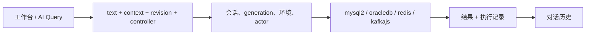

# DSH Database

[](LICENSE)
[](cordis.patch.yml)
[](https://github.com/zhuoxiaoshuai/dsh-database)

DeepSeek Harness 里的 MySQL、Oracle、Redis、Kafka。人和模型用同一套连接、同一份编辑器、同一次执行、同一份历史。

🌐 [English](README.md) ｜ **中文**

版本 **0.1.0-alpha.12.15**。一次性容器上的测试不能当成生产声明。

```sh
npm pack
dsh plugin --profile web add ./dsh-database-0.1.0-alpha.12.15.tgz
```

卸载：`dsh plugin --profile web remove dsh-database`。卸完就是官方 `dsh web`，不要再往 profile patch 手写同一行。桌面版自带 `dsh` 但不进 PATH，从托盘打开 **DSH 终端**，用 `--profile desktop`。

> [!IMPORTANT]
> **SIT** 会把查询单元格原值送给模型。UAT / PVT 拦住 AI 写入和网格 DML。人工 SQL 页在所有环境仍会自动提交（`lane: manual`）。保存一条连接，等于把这个账号交给 Host 进程。[SECURITY.md](SECURITY.md)。

## 数据

先标环境再查。UAT / PVT 不会把已经在 SIT 送给模型的单元格收回来。

| | |
| --- | --- |
| 密码、自定义 CA | 只在 Host。快照、日志、历史、给模型的输出里会剥掉。加密「记住密码」只在 Windows（DPAPI，stdin，当前用户），默认关 |
| SIT 查询单元格 | 原值给模型 |
| UAT / PVT 查询单元格 | AI 不能写。工具结果走 `redactQueryResult`（JOIN、`SELECT *` 会去掉单元格；简单单表列清单仍可能通过，除非加列规则） |
| SQL 编辑器写入 | 所有环境自动提交（`lane: manual`）。真正权限是数据库账号 |
| 网格 DML / DDL / AI `database_execute_sql` 写入 | 仅 SIT |
| `redis_execute` | 仅 SIT。命令台：一条 CLI 引号命令、单独连接、跑完关掉 |
| Kafka peek | 组名 `dsh-peek-{uuid}`，`autoCommit: false`，不提交 offset。GROUPS 不显示这些 id |
| BIGINT / NUMBER | Driver 里就是字符串（`bigNumberStrings` / `fetchTypeHandler`） |
| BLOB | `[BLOB n bytes]`，不把二进制倒出来 |

## 做什么

会话里一个「数据库」页签：左目录，右面是总览、查询、AI Query、经验、历史。四种源共用这套页面。Redis 是 SCAN 加命令台，不是假装成 SQL。Kafka peek 不进业务消费组。

在 AI Query 里打字会接管（`controller: user`），交还之前模型不能覆盖。mysql2、oracledb、redis、kafkajs 只在 Host Worker 里加载，浏览器走带认证的 `/plugins/database/...`。

不出图、不做自然语言报表，也不是第二套 Navicat。没有 PostgreSQL、ClickHouse、MongoDB、Elasticsearch。

新源抄 Kafka（`standard` + `standard-text`），不要克隆 MySQL。

## 截图

当前界面。连接名和样例行是夹具。

<p align="center">
  
</p>

*左：四种连接。右：Kafka Topics。*

<p align="center">
  
</p>

*分区、副本因子、Leader、水位。Peek 用临时消费者。*

<p align="center">
  
</p>

*SCAN 树、类型、TTL、值。命令台是另一条连接，`SELECT` / `MULTI` 不会留在浏览上。*

<p align="center">
  
</p>

*BIGINT 和精确小数是字符串。单元格不当 HTML 执行。*

<p align="center">
  
</p>

*Schema 树（大小写不敏感）。和 MySQL 同一套 SQL 页；Service Name / SID 和类型跟 Oracle。*

## 上手

需要能跑的 `dsh web`，Node.js ≥ 24。上面 `npm pack` 和 `dsh plugin add` 之后，重启 Web Profile。打开「数据库」，添加连接，先测试再连接。编辑失败会留下原来的活动会话。

连上之后可以跑：

```sql
SELECT 9007199254740993 AS too_big_for_js;
```

```text
PING
```

```text
PEEK "orders" PARTITION 0 FROM LATEST LIMIT 20
```

`"orders"` 换成你看得见的 Topic。历史按对话隔离。测过的 Harness：`0.1.2-rc.1`、`0.1.7-rc.2`、`0.2.0-rc.2`。现用 Desktop GUI 和真实模型 `callId` 关联还没跑过。

发到 npm 之后：`dsh plugin --profile web add dsh-database`。

## 数据源

| 源 | 常见用途 | 结果 |
| --- | --- | --- |
| MySQL | 目录、SQL | 网格、`SHOW CREATE` |
| Oracle | 一样，对着 Service / SID | `OFFSET FETCH` 网格 |
| Redis | Key、一条命令 | SCAN、类型、TTL、值 |
| Kafka | 看 Topic | 分区、水位、peek |

### MySQL

对象：库 → 表 → 列。反引号。`LIMIT … OFFSET …`。系统库保持可见。默认 `VARCHAR(255)` / `BIGINT`。Driver `mysql2`，端口 3306。

目录：树、搜索、字段 / 索引 / 约束，账号能读才给 `SHOW CREATE`。没权限会说明原因，不当成空。

查询：编辑器、格式化、取消（登录不断）。SELECT 在库端筛选 / 排序 / 分页。默认 100 行，上限 500 行、1 MiB，30 秒。网格写入：参数化、预览、一次确认、主键定位并核原记录；冲突回滚并留草稿。DDL：最多 20 步，审批 5 分钟一次消费，破坏性操作在同一窗口填目标名；首错停止，不承诺整段回滚。InnoDB 锁等待在一次性 8.4 容器上验过。

AI：`database_execute_sql`，SIT 最多 8 条（每条 100 行，可含 DML），首错停止。

### Oracle

同一套 SQL 页，方言不同。Schema 大小写不敏感；有用户名时默认落到该 Schema。标识符用 `"`。`OFFSET … ROWS FETCH FIRST … ROWS ONLY`。`EXPLAIN PLAN FOR`。支持 q-quote，不支持 `#` 注释。Driver `oracledb`，1521，Thin。SID 未验收。

列注释是独立字典。默认 `VARCHAR2(255)` / `NUMBER(19)`。视图、同义词只看元数据。查询碰到 LOB 列不支持。19c、SID、时间字段维护未验收。Free 23 Thin 不能当 19c。

### Redis

不是 SQL。DB → Key，加上类型和 TTL。一页是 SCAN 游标（可能空页、重复；界面会去重并提示还没扫完）。需要 Redis 7.2+。

单机、一台哨兵或一个集群种子。可选 ACL、TLS、自定义 CA。哨兵用一个地址问主库，用户名密码两边都用。集群把主机当种子，DB 固定 0。

命令台：一条 Redis CLI 引号命令，跑完关掉。Key 浏览：String / Hash / List / Set / ZSet / TTL，大集合分页，设/删 TTL，删除，改基础值。二进制 Base64。`DSH_REDIS_COMMAND_BLACKLIST` 默认空，权限仍看 ACL。`redis_execute` 仅 SIT。Cluster / Sentinel 对着业务集群未验收。

### Kafka

只读。Topic / 分区 / 已有消费组。Peek 只读一个分区，有上限。认证：无、TLS + 自定义 CA、SASL PLAIN、SCRAM-SHA-256 / 512。PLAIN/SCRAM 可以不开 TLS；开了 TLS 必须验证书。没有 Kerberos、OAuth、客户端证书。不发消息、不建删 Topic、不改配置、不挪 offset。

客户端 `standard`，Host `standard-text`。新源抄这条。

## 工具

和页签同一条路。用法说明按需加载（`database_status` 加 topic），不塞进每一轮。

| 工具 | |
| --- | --- |
| `database_status` | 已登录的 SQL/Redis 连接和 `generation`。带 topic 可加载说明 |
| `database_catalog` | `schemas` / `tables` / `table`。不要用 SQL 查 `information_schema`。读不到是 `unavailable` |
| `database_execute_sql` | `action=read` 返回 AI Query 当前文本。带 `sql`：SIT，最多 8 条，每条 100 行，首错停止。UAT/PVT 下这个工具只读 |
| `database_templates` | 经验库。保存不执行 |
| `database_read_collab` | 查询页签。`lastRun` 只有列名、行数、耗时 |
| `database_import_connections` | 只登记主机，不收密码。登录在工作台里做 |
| `redis_status` / `redis_keys` / `redis_value` | SCAN（空页会发生）、类型、TTL、分页值 |
| `redis_execute` | 仅 SIT。一条命令，单独连接 |
| `kafka_status` / `kafka_topics` / `kafka_describe` | 可见 Topic、分区、Leader、水位 |
| `kafka_peek` | 一个分区。先写入共用文档；已经接管则拒绝 |

## 工作原理

工作台和 AI Query 改的是同一份文档（`text`、`context`、`revision`、`controller`）。Host `ConnectionService` 核对会话、连接 `generation`、环境、actor（只有 `user` / `ai`，浏览器不能伪造 `ai`）。源模块把文本变成 worker action，runtime 再对白名单。Kafka 只允许它解析出来的读操作。



连接存在工作区文件里。查询页签和 AI 文档按对话隔离。重连会换 `generation`，进行中的请求作废。

Redis、Kafka 用 `ExecutionDocument`。MySQL、Oracle 仍用 `SharedQuery`，但在同一个 AI Query 页签上，接管规则一样。`SourceWorkspace` 是总览 / 查询 / AI Query / 经验；源只提供 Editor、Result、`runText` 和树。

`updateExecutionDocument` 在 `controller !== 'ai'` 时拒绝 AI 写入。第一下按键走 `saveDraft(..., takeControl=true)`，变成 `controller: user`。交还是 `return-ai`，没保存交不回去。`runExecutionDocument` 要求 `controller === 'user'` 且 revision 对得上。Redis DB 记在 `context` 里，切换会加 revision、保留控制权、取消旧请求。

`peekKafkaPartition`：`dsh-peek-{uuid}`，`autoCommit: false`，seek 一个分区，然后 `stop` / `disconnect`。清理超时会回收 Worker（`recycleWorker`）。`visibleGroupIds` 会藏掉 `dsh-peek-` 开头的名字。

MySQL 目录 / 维护 / 查询连接开了 `supportBigNumbers` 和 `bigNumberStrings`。Oracle 查询用 `oracleFetchTypeHandler`，NUMBER 和时间以 STRING 进来。`formatFetchedValue` 把 Buffer 写成 `[BLOB n bytes]`。网格单元格不当 HTML。

`normalizeEnvironment`：`dev` / `test` → SIT；`staging` → UAT；`prod` → PVT；其余 → UAT。网格维护只在 SIT。

一次执行一条记录：成功、失败、取消、空、部分、**未知**。未知表示写入超时后库端可能已经生效，界面不假装回滚。peek / 查询默认 30 秒。

| 共用 | 各源自己 |
| --- | --- |
| 页签、连接、DPAPI、对话隔离 | host/port、Service/SID、SASL、Redis 模式 |
| Loading / Error / Empty、结果框 | 树的形状 |
| 执行身份、取消、历史 | `LIMIT`、SCAN 游标、peek offset |
| AI Query、接管、revision | 命令、授权 |
| `knowledge.json`（人工确认） | 指纹 / 分析 |

| 源 | 客户端 | Host |
| --- | --- | --- |
| MySQL | `legacy-sql` | `legacy-adapter` |
| Oracle | `legacy-sql` | `legacy-adapter` |
| Redis | `standard` | `legacy-adapter` |
| Kafka | `standard` | `standard-text` |

经验保存不执行。试运行走同一条授权。旧 `sql-templates.json` 会读进 `knowledge.json` 一次。

更细的：[docs/README.md](docs/README.md)、[架构](docs/data-source-architecture.md)、[接入](docs/data-source-onboarding.md)。

## 限制

| 环境 | 人工 | AI |
| --- | --- | --- |
| SIT | 跟账号权限；网格 DML/DDL 可走 | 单元格原值；可 DML；可 `redis_execute` |
| UAT / PVT | SQL 编辑器仍可写（自动提交）；网格 DML 拦住 | 不能写；不能 Redis execute |
| DDL | 要确认 | 不自动跑 |

| | |
| --- | --- |
| Node.js | ≥ 24；隔离加载用 Desktop 自带 Node |
| Harness | `0.1.2-rc.1`、`0.1.7-rc.2`、`0.2.0-rc.2` |
| MySQL | 8.4.x 一次性容器；8.0.32 只核对只读 |
| Oracle | Free 23 Thin，不是 19c / SID |
| Redis | 8.10.2 一次性容器 |
| 驱动 | mysql2 3.24.4、oracledb 7.0.1、redis 6.2.1、kafkajs 2.2.4 |

不宣称：Oracle LOB 查询；19c / SID / 时间字段维护；业务集群上的 Redis Cluster / Sentinel；Kafka 发消息 / Kerberos / OAuth / 客户端证书；PostgreSQL / ClickHouse / Mongo / ES / 出图；现用 Desktop GUI 和真实 `callId` 关联。

## 常见问题

| 现象 | |
| --- | --- |
| `/plugins/database/connections` 冲突 | 卸掉仍内嵌这套工作台的旧 remote-exec。和现在的 `dsh-remote-exec` 可以并存 |
| Desktop 找不到 `dsh` | 托盘里的 DSH 终端 |
| add 之后没有插件 | 重启 Web Profile，刷新，不要手写重复的 `cordis.patch.yml` |
| Oracle 查询碰到 LOB | 当前不支持 |
| 命令台 `SELECT` 了，Key 树没变 | 正常，在树里选 DB |
| peek 会不会带动业务消费组 | 不会 |

## FAQ

**模型能看到密码吗？** 不能。快照、日志、历史和给模型的输出里都剥掉。Windows 记住密码也不会回到浏览器。

**模型能看到行吗？** SIT 能。UAT / PVT 拦住 AI 写入和网格 DML，SQL 编辑器仍可能提交。账号权限才是真正限制。

**能替代 Navicat 吗？** 不能。会话旁边查目录、跑 SQL。重型 DBA 还是用专用客户端。

**PostgreSQL / Mongo / ES？** 本包没有。要加就抄 Kafka 的 `standard` + `standard-text`，不要克隆 MySQL。

**peek 断开很慢？** Worker 带超时 `stop` / `disconnect`，失败就回收 Worker。

## 开发

```sh
npm ci --legacy-peer-deps
npm run check
```

实库脚本会建带唯一标签的临时 Docker 容器再删掉。不要对着业务库跑。

```sh
npm run test:mysql
npm run test:oracle
DSH_TEST_REDIS=1 npm run test:host
DSH_TEST_DATABASES=1 npm run test:host
```

隔离宿主：`DSH_DESKTOP_APP=... npm run test:host`。`DSH_TEST_ALLOW_VERSION` 只用于诊断。

问题：[GitHub Issues](https://github.com/zhuoxiaoshuai/dsh-database/issues)。漏洞按 [SECURITY.md](SECURITY.md) 私下报。

仓库满一天后，向 [awesome-dsh-plugin](https://github.com/awesome-dsh-plugin/awesome-dsh-plugin) 提交 `data/plugins/zhuoxiaoshuai__dsh-database.yml`（Topics 已有 `dsh-plugin`）：

```yaml
url: https://github.com/zhuoxiaoshuai/dsh-database
name: zhuoxiaoshuai/dsh-database
category: dev
description:
  en: MySQL, Oracle, Redis, and Kafka workbench for DeepSeek Harness, with a shared execution path for humans and the model.
  zh: DeepSeek Harness 的 MySQL、Oracle、Redis、Kafka 工作台，人和模型共用同一套连接、执行和记录。
```

## 许可证

[MIT](LICENSE)
