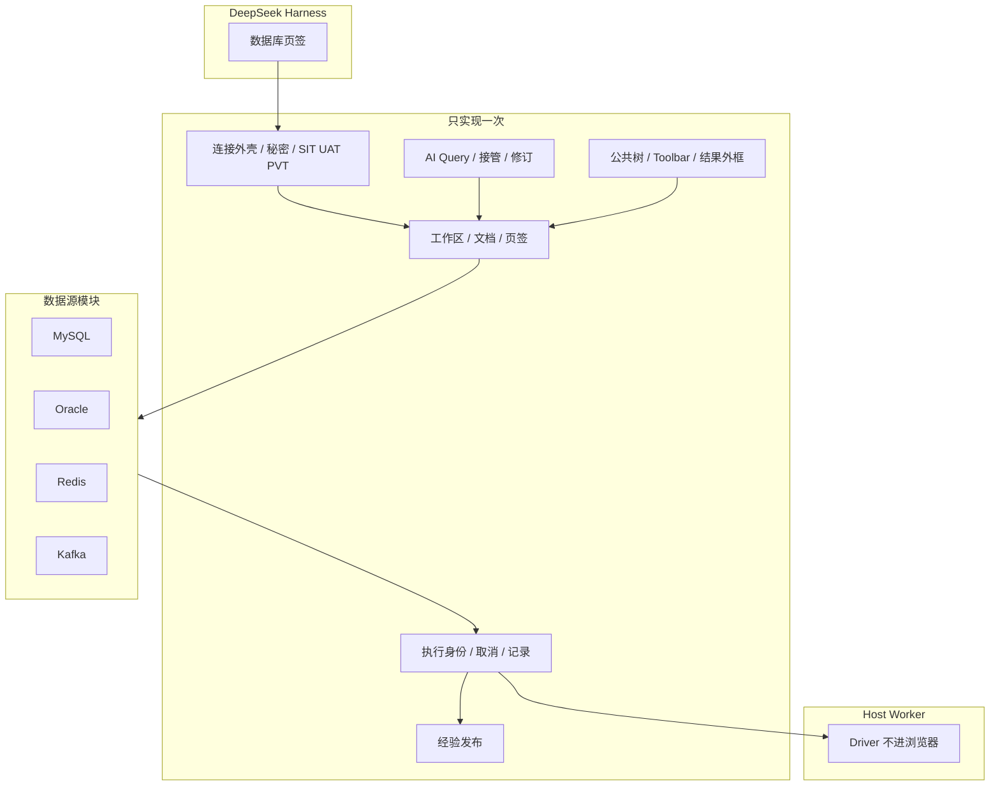

# dsh-database

<div align="center">
  🌏 <a href="./README.md">English</a> · <a href="./README.zh.md"><b>中文</b></a>
</div>

<br />

[](LICENSE)
[](https://github.com/zhuoxiaoshuai/dsh-database)
[](README.md)

DeepSeek Harness 的 MySQL、Oracle、Redis、Kafka 工作台。人和模型共用连接、文档、执行、结果和记录。

当前版本 **0.1.0-alpha.12.15**。

<p align="center">
  
</p>

<p align="center"><sub>当前工作台：四种源同一棵树。Kafka 展示 Topic 元数据（分区、副本因子、水位）。peek 不加入业务消费组。</sub></p>

## 亮点

- **抽出一套平台，四个接入渠道。** MySQL、Oracle、Redis、Kafka 进同一个「数据库」页签。流程只实现一次；各源只登记真实差异。
- **人和模型走同一条路。** 正式 AI 入口是工作台里的 **AI Query**。人改过的内容模型接着执行；模型跑过的内容人可以打开、接管、继续改。
- **执行为一等对象。** 每次运行有身份、代次、取消、超时、历史，以及成功 / 失败 / 取消 / 空 / 未知的诚实结果。
- **环境是闸，不是标签。** SIT 可写。UAT / PVT 对 AI 和类生产连接只读。DDL 仍须人工确认。
- **秘密留在 Host。** 密码和自定义 CA 不回连接快照、日志、查询历史或模型输出。Windows 勾选记住密码时用当前用户 DPAPI。
- **不强行统一语义。** Redis 不是 SQL。Kafka peek 不加入业务消费组、不提交 offset。分页、游标、结果形状跟数据源走。

## 截图

当前工作台界面（0.1.0-alpha.12.15）。连接名和样例行是一次性夹具，不是业务集群。大整数和精确小数按字符串展示。

| Redis Key、TTL、JSON | MySQL 结果网格 |
| --- | --- |
|  |  |

| Oracle 目录 | 四个源，一棵树 |
| --- | --- |
|  |  |

## 架构

这是一套**抽出的数据源平台**，不是四个迷你 IDE 粘在一起。Workspace、AI 协作、接管、执行、History、Knowledge、秘密、环境闸、页面外框只存在**一次**。MySQL、Oracle、Redis、Kafka 是这套平台上的模块：各登记真实差异，其余复用。

加一种源不是再复制一套产品。拿掉一种源，平台仍然成立。



### 抽出的公共底座

下列能力不属于任何方言。明天删掉 Kafka 或 Redis，它们仍应成立。

| 块 | 公共内容 |
| --- | --- |
| 入口 | 会话旁「**数据库**」页签。连接：`$DSH_HOME/database/database-workspace.json`（工作区）。查询页签、草稿、历史：`conversation-workbenches/`（对话）。 |
| 连接外壳 | 添加 / 测试 / 连接 / 编辑 / 复制 / 断开。编辑失败保留原来的活动会话。「记住密码」默认不勾；Windows 用当前用户 DPAPI。密码和自定义 CA 不回快照、日志、查询历史或模型输出。 |
| 工作台外框 | 左侧目录，页签（总览 / 查询 / **AI Query** / 经验 / 历史），公共 Loading / Error / Empty / Dialog。 |
| 执行 | 身份、代次、取消、超时、按对话的记录。成功、失败、取消、空、部分、未知分开说。 |
| AI 车道 | 同一份文档、同一条执行链。人一打字就接管；交还后模型才能继续。点历史即打开该文档。其他连接上的活动只出提示条，不抢当前连接。 |
| 经验 | 一份 `knowledge.json`（首次仍可读 `sql-templates.json`）。发布要人工确认。指纹留在各源。 |
| 环境 | 连接上选 SIT / UAT / PVT。类生产连接在工作台只读。DDL 仍须人工一步。 |

Driver 只在 Host Worker 里加载，浏览器不加载。

### 留给各源的

模块只负责依赖自身协议的部分：

连接字段、Driver/Worker、校验/指纹、对象模型、命令语言、授权、一页怎么读（`LIMIT`、`SCAN`、peek offset）、结果形状、补全、AI 参数 → 原生文本、经验指纹，以及只有该源才有的能力。

平台**不要求**每个源都有 host/port/database、每棵树都是 Schema/Table、每个结果都是二维表，也不把 Redis/Kafka 做成 SQL。

| 层 | 负责 | 不负责 |
| --- | --- | --- |
| 平台 | 流程、生命周期、对话隔离、修订、取消、历史、公共外框 | 字段长什么样、SQL vs RESP vs peek、SCAN 怎么翻页 |
| 数据源模块 | Worker、对象、授权、结果投影、补全 | 第二套 AI 页、第二套 History、再抄一份 Toolbar |

### 四个渠道怎么接进来

| 源 | 客户端 | Host 执行 | 含义 |
| --- | --- | --- | --- |
| MySQL | `legacy-sql` | `legacy-adapter` | 目录、SQL 批量、InnoDB DML/DDL 网格、事务——仍走 SQL 兼容路径 |
| Oracle | `legacy-sql` | `legacy-adapter` | 同一条 SQL 路径；Service/SID、Schema 大小写、分页、类型跟 Oracle |
| Redis | `standard` | `legacy-adapter` | 标准工作台页签；命令隔离和 SCAN 仍走 Redis 适配 |
| Kafka | `standard` | `standard-text` | 新源该走的路：`normalizeContext` / `prepareText` / `authorize`，再进 Worker action 白名单 |

新源应按 **standard + standard-text** 接入，不要复制 MySQL。SQL/Redis 适配是兼容边界，不是模板。

人或模型：文档 → 授权 → Worker action 白名单 → 源结果投影 → 公共结果外框 → 记录。一条路。

更细的说明：[docs/README.md](docs/README.md)、[架构](docs/data-source-architecture.md)、[接入指南](docs/data-source-onboarding.md)。

## 接入渠道

下面各章只写真实差异。公共流程见上一节。

### MySQL

关系型 SQL。对象：**数据库 → 表 → 列**。标识符用反引号。分页：`LIMIT … OFFSET …`。系统库（`mysql`、`information_schema`、`performance_schema`、`sys`）保持可见。默认类型：`VARCHAR(255)` / `BIGINT`。`#` 注释和 `EXPLAIN` 跟 MySQL。

- **连接：** host / port / 用户 / 密码，默认 3306。Driver `mysql2` 在 Host Worker。
- **目录：** 树、搜索、对象页。字段、索引、约束，以及账号有权读取的 `SHOW CREATE`。读不到给原因，不当作零。列注释写在类型行上。
- **查询：** SQL 编辑器，格式化，取消（不断开共享登录），对话私有历史。SELECT 走库端筛选 / 排序 / 分页。默认 100 行，最多 500 行、1 MiB，单请求 30 秒。
- **写入：** 参数化增改删，预览后一次确认，主键定位并核对原记录。冲突回滚并保留草稿。DDL：建表、字段、索引、注释、重命名、清空/删除，最多 20 步，审批 5 分钟一次消费。破坏性操作在同一窗口填写目标名。首错停止，不承诺 DDL 整体回滚。InnoDB 锁等待在一次性 8.4 容器上验过。
- **结果：** BIGINT 和精确小数按字符串。单元格不当 HTML 执行。
- **AI：** `database_execute_sql`，SIT 最多 8 条（每条 100 行，可含 DML），首错停止。

### Oracle

和 MySQL 同一套 SQL 工作台，方言不同。对象：**Schema**（大小写不敏感）。有用户名时默认落到该 Schema。标识符用 `"`。分页：`OFFSET … ROWS FETCH FIRST … ROWS ONLY`。`EXPLAIN PLAN FOR`。支持 q-quote，不支持 `#` 注释。

- **连接：** Service Name 或 SID，端口 1521，Thin 模式。SID 未验收。Driver `oracledb`。指纹含 service / SID。
- **目录 / 查询 / 写入：** 与 MySQL 走同一条平台路径。列注释是独立字典，不写在类型行上。默认类型：`VARCHAR2(255)` / `NUMBER(19)`。
- **限制：** 视图、同义词只看元数据。含 LOB 的查询不支持。19c、SID、时间字段维护未验收。Free 23 Thin 不替代 19c。

### Redis

不是 SQL。对象：**DB → Key**，加上类型和 TTL。一页是 **SCAN 游标**（可能空页和重复；界面去重并提示尚未扫完）。需要 Redis 7.2+。

- **连接：** 单机、一台哨兵或一个集群种子。可选 ACL、TLS、自定义 CA。哨兵用一个地址问主库；用户名密码同时用于哨兵和 Redis。集群把主机当种子，DB 固定 0。
- **两条连接是故意的：** 命令台每次一条，按 Redis CLI 引号解析，跑完即关，所以 `SELECT` / `AUTH` / `MULTI` 不会留在 Key 浏览连接上。不经 Shell。
- **Key：** String / Hash / List / Set / ZSet / TTL，大集合分页，设/删 TTL，删除，编辑基础值。二进制显示 Base64。
- **Host：** `DSH_REDIS_COMMAND_BLACKLIST`（默认空）。AI 的 `redis_execute` 仅 SIT；UAT/PVT 只留 status / keys / 读值。
- **未验收：** Cluster / Sentinel 对着业务集群。

### Kafka

只读观察。对象：**Topic / 分区 / 已有消费组**。Peek 是对**一个**分区的有界读取。不加入业务消费组，不提交 offset。

- **连接：** 无认证、TLS + 自定义 CA、SASL PLAIN、SCRAM-SHA-256 / 512。PLAIN/SCRAM 可不启用 TLS；启用 TLS 时必须验证书（可自定义 CA，不提供跳过验证）。Kerberos、OAuth、客户端证书不在范围内。
- **工作：** 列出 Topic、查看分区、有界 peek。结果是消息和分区元数据，不是 SQL 网格。
- **不做：** 发消息、建删 Topic、改配置、移动消费位置。
- **接入形态：** 客户端 `standard` + Host `standard-text`。新源应抄这条，不要抄 MySQL。

## AI 与接管

- 入口是工作台 **AI Query**，不是按源再做一套 Agent 控制台。
- SIT：单元格原值给模型。SQL 可 DML；Redis 可 `redis_execute`。
- UAT / PVT：AI 禁写。拒绝 Redis execute。
- 点历史即打开将执行或已执行的文档。人在编辑器里输入即接管。

## 经验库

SQL 经验与 Redis/Kafka 知识写入同一份 `knowledge.json`。指纹和保存校验按源实现。发布要人工确认。保存不执行；试运行走同一条授权路径。

## 一直守着的设计

1. **同一业务状态一个权威来源。** 可以有只读投影，不能有两份可独立改的副本。
2. **AI 和人是同一条流水线。** 不为某个方言再做一套 Agent 工作台。
3. **失败要可见。** 取消、超时、空、部分、未知分开说。维护超时可能让库端状态未知——界面如实写。
4. **不为了代码整齐去统一 Kafka offset 和 Redis SCAN。** 统一的是用户怎么走完这条路。
5. **拿掉一种数据源，平台仍然成立。** 加一种源，原则上不改 MySQL 的业务实现。

## 环境策略

| 环境 | 人工 | AI |
| --- | --- | --- |
| SIT | 跟账号权限 | 单元格原值；允许 DML；允许 Redis `redis_execute` |
| UAT / PVT | 类生产连接只读 | 禁写；拒绝 Redis execute |
| DDL | 人工确认 | 不自动跑 |

详见 [SECURITY.md](SECURITY.md)。

## 安装

需要已能运行的 DSH（`dsh web`），Node.js ≥ 24。

```sh
npm pack
dsh plugin --profile web add ./dsh-database-0.1.0-alpha.12.15.tgz
```

装到 npm 之后：

```sh
dsh plugin --profile web add dsh-database
```

安装由包内 `cordis.patch.yml` 挂载。不要再往 profile patch 手写同一行。卸载：`dsh plugin --profile web remove dsh-database`。

不要同时安装旧的「内嵌数据库的 remote-exec」，二者都会占用 `/plugins/database/connections`。本插件与 `dsh-remote-exec` 可以并存。

## 限制

- 视图、同义词可看元数据；含 LOB 的 Oracle 查询暂不支持。
- Oracle 19c、SID、时间字段维护未验收。
- Redis Cluster / Sentinel、真实业务集群未验收。
- Kafka 不发消息、不改 offset，不支持 Kerberos / OAuth / 客户端证书。
- 现用 Desktop GUI 与真实模型 callId 关联仍为未跑。隔离 profile 的证据不能当成生产声明。

| 环境 | 说明 |
| --- | --- |
| Node.js | ≥ 24；隔离加载用 Desktop 内置 Node |
| Harness | 已验证 `0.1.2-rc.1`、`0.1.7-rc.2`、`0.2.0-rc.2` |
| MySQL | 8.4.x 临时容器；8.0.32 仅只读核对 |
| Oracle | Free 23 Thin 模式，不替代 19c/SID |
| Redis | 8.10.2 一次性容器 |
| 驱动 | mysql2 3.24.4、oracledb 7.0.1、redis 6.2.1、kafkajs 2.2.4 |

## 开发

```sh
npm ci --legacy-peer-deps
npm run check
```

实库脚本会创建带唯一标签的临时 Docker 容器并删除。不要对着业务库跑。

```sh
npm run test:mysql
npm run test:oracle
DSH_TEST_REDIS=1 npm run test:host
DSH_TEST_DATABASES=1 npm run test:host
```

设置 `DSH_DESKTOP_APP` 为 Desktop 安装根目录，再 `npm run install:desktop`（只交 tgz，不链源码）。隔离宿主：`DSH_DESKTOP_APP=... npm run test:host`。`DSH_TEST_ALLOW_VERSION` 仅用于诊断。

## 目录收录

仓库创建满一天后，向 [awesome-dsh-plugin](https://github.com/awesome-dsh-plugin/awesome-dsh-plugin) 提交 `data/plugins/zhuoxiaoshuai__dsh-database.yml`：

```yaml
url: https://github.com/zhuoxiaoshuai/dsh-database
name: zhuoxiaoshuai/dsh-database
category: dev
description:
  en: MySQL, Oracle, Redis, and Kafka workbench for DeepSeek Harness, with a shared execution path for humans and the model.
  zh: DeepSeek Harness 的 MySQL、Oracle、Redis、Kafka 工作台，人和模型共用同一套连接、执行和记录。
```

GitHub Topics 已包含 `dsh-plugin`。

## License

MIT
