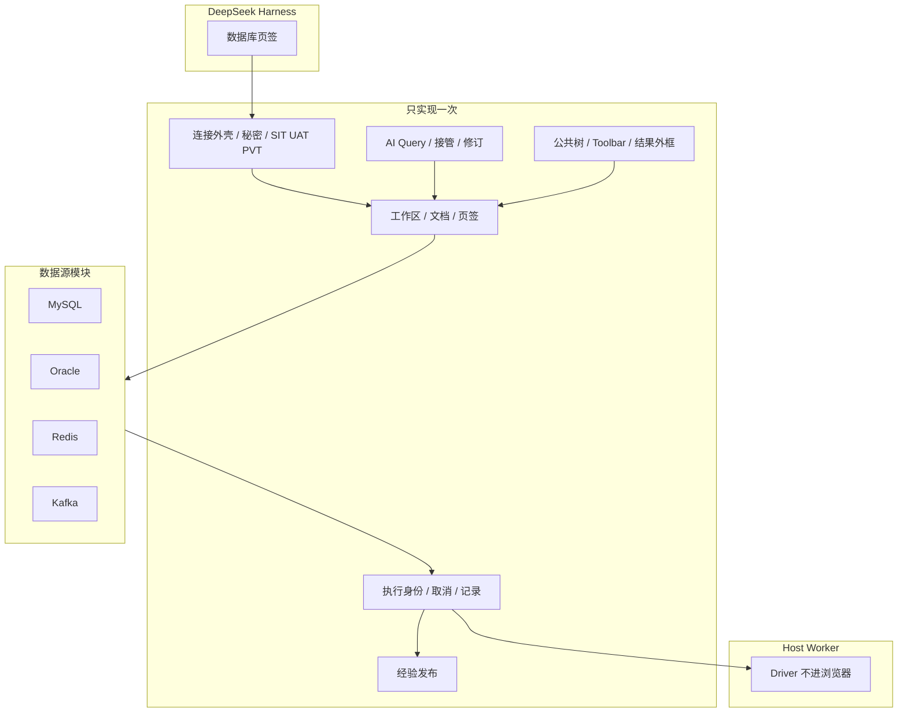

# DSH Database

[](LICENSE)
[](cordis.patch.yml)
[](https://github.com/zhuoxiaoshuai/dsh-database)

**DeepSeek Harness 的 MySQL、Oracle、Redis、Kafka 工作台：人和模型共用连接、文档、执行、结果和记录。**

🚀 一个「数据库」页签 ｜ 四种源 ｜ 同一条执行路

[亮点](#亮点) ｜ [适合谁用](#适合谁用) ｜ [实际效果](#实际效果) ｜ [快速开始](#快速开始三步完成) ｜ [数据源](#数据源) ｜ [工作原理](#工作原理) ｜ [限制](#配置与限制)

🌐 [English](README.md) ｜ **中文**

当前版本 **0.1.0-alpha.12.15**。隔离 profile 的证据不能当成生产声明。

> 如果这个插件有用，点个 Star 方便其他 DSH 用户找到。

## 亮点

- **一个页签，四种源。** MySQL、Oracle、Redis、Kafka 进会话旁的「数据库」页签。加一种源是登记真实差异，不是再复制一套产品。
- **不是第二套产品。** 正式 AI 入口是工作台里的 **AI Query**。人改过的内容模型接着执行；模型跑过的内容人可以打开、接管、继续改。
- **执行为一等对象。** 每次运行有身份、代次、取消、超时、历史。成功、失败、取消、空、部分、未知分开说。
- **环境是闸。** SIT 可写。UAT / PVT 对 AI 和类生产连接只读。DDL 仍须人工确认。
- **秘密留在 Host。** 密码和自定义 CA 不回快照、日志、查询历史或模型输出。Windows 勾选记住密码时用当前用户 DPAPI。

本项目两层：

1. **抽出的工作台：** Workspace、AI Query、接管、执行、History、Knowledge、页面外框只存在一次。
2. **四个数据源模块：** 各负责协议、对象、命令、授权和结果形状。

```sh
dsh plugin --profile web add ./dsh-database-0.1.0-alpha.12.15.tgz
```

**目录**

- [亮点](#亮点)
- [适合谁用](#适合谁用)
- [实际效果](#实际效果)
- [快速开始：三步完成](#快速开始三步完成)
- [数据源](#数据源)
- [工作原理](#工作原理)
- [配置与限制](#配置与限制)
- [常见问题](#常见问题)
- [开发与社区](#开发与社区)

## 适合谁用

1. 已经在用 DeepSeek Harness，希望 MySQL / Oracle / Redis / Kafka 就在会话旁边，而不是另开一套 IDE。
2. 希望模型和人跑同一份 SQL、Redis 命令或 Kafka peek：能打开、改、接管，而不是按方言再做一套 Agent 控制台。

## 实际效果

### 四个源，一棵树

<p align="center">
  
</p>

*左：MySQL、Oracle、Redis、Kafka 连接。右：Kafka Topics。查询页签、AI Query、经验库是同一套外框。*

### Kafka Topic 元数据

<p align="center">
  
</p>

*分区、副本因子、Leader、水位。Peek 用临时消费者，不加入业务消费组、不提交 offset。*

### Redis Key 和值

<p align="center">
  
</p>

*SCAN 树、类型、TTL、JSON 值。命令台是另一个页签、另一条连接，所以 `SELECT` / `AUTH` / `MULTI` 不会留在浏览连接上。*

### MySQL 结果网格

<p align="center">
  
</p>

*BIGINT 和精确小数按字符串展示。单元格不当 HTML 执行。*

### Oracle 目录

<p align="center">
  
</p>

*Schema 树（大小写不敏感）。和 MySQL 同一套 SQL 工作台；Service Name / SID、分页、类型跟 Oracle。*

截图是当前工作台。连接名和样例行是一次性夹具，不是业务集群。

## 快速开始：三步完成

### 1. 安装

需要已能运行的 DSH（`dsh web`），Node.js ≥ 24。

```sh
npm pack
dsh plugin --profile web add ./dsh-database-0.1.0-alpha.12.15.tgz
```

装到 npm 之后：

```sh
dsh plugin --profile web add dsh-database
```

使用 **DSH Desktop 桌面版**？桌面版自带 `dsh`，但有意不写入系统 PATH。请从托盘打开 **DSH 终端**：

```sh
dsh plugin --profile desktop add ./dsh-database-0.1.0-alpha.12.15.tgz
```

然后重启 Desktop。`npm run install:desktop` 会把 tarball 装进 profile（设置 `DSH_DESKTOP_APP` 为安装根目录，不链源码）。

安装由包内 `cordis.patch.yml` 挂载。不要再往 profile patch 手写同一行。卸载：`dsh plugin --profile web remove dsh-database`。

### 2. 重启并打开页签

重启正在运行的 Web Profile。在会话里打开「**数据库**」页签，添加连接，先 **测试** 再 **连接**。编辑失败会保留原来的活动会话。

### 3. 跑一条人能接管的操作

- MySQL / Oracle：打开一张表或跑 SQL。历史按对话隔离。
- Redis：选一个 DB，浏览 Key，或在命令台跑一条命令。
- Kafka：打开 Topic，再对一个分区做有界 peek。

模型和人用同一份文档。人一打字就接管。

## 数据源

各源复用上面的工作台。表是地图，下面各章只写真实差异。

| 源 | 最适合问的问题 | 主要结果 |
| --- | --- | --- |
| MySQL | 这个库 / 表里有什么？跑这条 SQL。 | 目录、`SHOW CREATE`、结果网格 |
| Oracle | 一样，对着 Service / SID 的 Schema | Schema 树、`OFFSET FETCH` 网格 |
| Redis | 这个 Key 是什么？跑这条命令。 | SCAN 树、类型、TTL、值 |
| Kafka | 这个 Topic 上有什么？ | 分区、水位、有界 peek |

### MySQL

关系型 SQL。对象：**数据库 → 表 → 列**。标识符用反引号。分页：`LIMIT … OFFSET …`。系统库（`mysql`、`information_schema`、`performance_schema`、`sys`）保持可见。默认类型：`VARCHAR(255)` / `BIGINT`。

- **连接：** host / port / 用户 / 密码，默认 3306。Driver `mysql2` 在 Host Worker。
- **目录：** 树、搜索、对象页。字段、索引、约束，以及账号有权读取的 `SHOW CREATE`。读不到给原因，不当作零。
- **查询：** SQL 编辑器，格式化，取消（不断开共享登录）。SELECT 走库端筛选 / 排序 / 分页。默认 100 行，最多 500 行、1 MiB，单请求 30 秒。
- **写入：** 参数化增改删，预览后一次确认，主键定位并核对原记录。冲突回滚并保留草稿。DDL 最多 20 步，审批 5 分钟一次消费；破坏性操作在同一窗口填写目标名。首错停止，不承诺 DDL 整体回滚。InnoDB 锁等待在一次性 8.4 容器上验过。
- **AI：** `database_execute_sql`，SIT 最多 8 条（每条 100 行，可含 DML），首错停止。

### Oracle

和 MySQL 同一套 SQL 工作台，方言不同。对象：**Schema**（大小写不敏感）。有用户名时默认落到该 Schema。标识符用 `"`。分页：`OFFSET … ROWS FETCH FIRST … ROWS ONLY`。`EXPLAIN PLAN FOR`。支持 q-quote，不支持 `#` 注释。

- **连接：** Service Name 或 SID，端口 1521，Thin 模式。SID 未验收。Driver `oracledb`。
- **目录 / 查询 / 写入：** 与 MySQL 走同一条平台路径。列注释是独立字典。默认类型：`VARCHAR2(255)` / `NUMBER(19)`。
- **限制：** 视图、同义词只看元数据。含 LOB 的查询不支持。19c、SID、时间字段维护未验收。Free 23 Thin 不替代 19c。

### Redis

不是 SQL。对象：**DB → Key**，加上类型和 TTL。一页是 **SCAN 游标**（可能空页和重复；界面去重并提示尚未扫完）。需要 Redis 7.2+。

- **连接：** 单机、一台哨兵或一个集群种子。可选 ACL、TLS、自定义 CA。哨兵用一个地址问主库；用户名密码同时用于哨兵和 Redis。集群把主机当种子，DB 固定 0。
- **两条连接是故意的：** 每次一条 Redis CLI 引号命令，跑完即关。不经 Shell。
- **Key：** String / Hash / List / Set / ZSet / TTL，大集合分页，设/删 TTL，删除，编辑基础值。二进制显示 Base64。
- **Host：** `DSH_REDIS_COMMAND_BLACKLIST`（默认空）。AI 的 `redis_execute` 仅 SIT；UAT/PVT 只留 status / keys / 读值。
- **未验收：** Cluster / Sentinel 对着业务集群。

### Kafka

只读观察。对象：**Topic / 分区 / 已有消费组**。Peek 是对**一个**分区的有界读取。不加入业务消费组，不提交 offset。

- **连接：** 无认证、TLS + 自定义 CA、SASL PLAIN、SCRAM-SHA-256 / 512。PLAIN/SCRAM 可不启用 TLS；启用 TLS 时必须验证书（不提供跳过验证）。Kerberos、OAuth、客户端证书不在范围内。
- **工作：** 列出 Topic、查看分区、有界 peek。结果是消息和元数据，不是 SQL 网格。
- **不做：** 发消息、建删 Topic、改配置、移动消费位置。
- **接入形态：** 客户端 `standard` + Host `standard-text`。新源应抄这条，不要抄 MySQL。

## 工作原理

这是一套**抽出的数据源平台**，不是四个迷你 IDE。加一种源不是再复制一套产品。拿掉一种源，平台仍然成立。



**只实现一次的：** 「数据库」页签；工作区连接（`$DSH_HOME/database/database-workspace.json`）与对话工作台（`conversation-workbenches/`）；添加 / 测试 / 连接 / 编辑；AI Query 与接管；执行身份与记录；一份 `knowledge.json`（首次仍可读 `sql-templates.json`）；SIT / UAT / PVT。

**留给各源的：** 连接字段、Driver/Worker、对象、命令语言、授权、一页怎么读（`LIMIT`、`SCAN`、peek offset）、结果形状、补全、AI 参数 → 原生文本。

平台**不要求**每个源都有 host/port/database、每棵树都是 Schema/Table，也不把 Redis/Kafka 做成 SQL。

| 源 | 客户端 | Host 执行 |
| --- | --- | --- |
| MySQL | `legacy-sql` | `legacy-adapter` |
| Oracle | `legacy-sql` | `legacy-adapter` |
| Redis | `standard` | `legacy-adapter` |
| Kafka | `standard` | `standard-text` |

新源应按 **standard + standard-text** 接入。SQL/Redis 适配是兼容边界，不是模板。

人或模型：文档 → 授权 → Worker action 白名单 → 源结果投影 → 公共结果外框 → 记录。一条路。

一直守着的：同一业务状态一个权威来源；AI 和人是同一条流水线；失败要可见（维护超时后的未知也如实写）；不为了代码整齐去统一 Kafka offset 和 Redis SCAN；加一种源原则上不改 MySQL。

更细的说明：[docs/README.md](docs/README.md)、[架构](docs/data-source-architecture.md)、[接入指南](docs/data-source-onboarding.md)。

## 配置与限制

### 环境

| 环境 | 人工 | AI |
| --- | --- | --- |
| SIT | 跟账号权限 | 单元格原值；允许 DML；允许 Redis `redis_execute` |
| UAT / PVT | 类生产连接只读 | 禁写；拒绝 Redis execute |
| DDL | 人工确认 | 不自动跑 |

详见 [SECURITY.md](SECURITY.md)。

### 不宣称的

- 视图、同义词只看元数据。含 LOB 的 Oracle 查询不支持。
- Oracle 19c、SID、时间字段维护未验收。
- Redis Cluster / Sentinel、真实业务集群未验收。
- Kafka 不发消息、不改 offset，不支持 Kerberos / OAuth / 客户端证书。
- 现用 Desktop GUI 与真实模型 callId 关联仍为未跑。

| 环境 | 说明 |
| --- | --- |
| Node.js | ≥ 24；隔离加载用 Desktop 内置 Node |
| Harness | 已验证 `0.1.2-rc.1`、`0.1.7-rc.2`、`0.2.0-rc.2` |
| MySQL | 8.4.x 临时容器；8.0.32 仅只读核对 |
| Oracle | Free 23 Thin 模式，不替代 19c/SID |
| Redis | 8.10.2 一次性容器 |
| 驱动 | mysql2 3.24.4、oracledb 7.0.1、redis 6.2.1、kafkajs 2.2.4 |

## 常见问题

| 问题 | 处理方式 |
| --- | --- |
| `/plugins/database/connections` 冲突 | 不要同时安装仍内嵌数据库工作台的旧 remote-exec。本插件与 `dsh-remote-exec` 可以并存 |
| Desktop 提示找不到 `dsh` | 从托盘打开 **DSH 终端**；桌面版不把 `dsh` 写入 PATH |
| add 之后看不到插件 | 重启 Web Profile 并刷新。确认没有手写重复的 `cordis.patch.yml` |
| Oracle 查询碰到 LOB 列失败 | 当前版本不支持；视图/同义词只看元数据 |
| 命令台里 `SELECT` 了，Key 树没变 | 预期行为：命令台用完即关连接；在树里选 DB |
| Kafka peek 会不会带动业务消费组 | 不会。Peek 用临时消费者，不提交 offset |

## 开发与社区

```sh
npm ci --legacy-peer-deps
npm run check
```

实库脚本会创建带唯一标签的临时 Docker 容器并删除。不要对着业务库跑。

```sh
npm run test:mysql
npm run test:oracle
DSH_TEST_REDIS=1 npm run test:host
DSH_TEST_DATABASES=1 npm run test:host
```

隔离宿主：`DSH_DESKTOP_APP=... npm run test:host`。`DSH_TEST_ALLOW_VERSION` 仅用于诊断。

- Bug 和使用问题：[GitHub Issues](https://github.com/zhuoxiaoshuai/dsh-database/issues)
- 安全漏洞按 [SECURITY.md](SECURITY.md) 私下报告
- 仓库创建满一天后，向 [awesome-dsh-plugin](https://github.com/awesome-dsh-plugin/awesome-dsh-plugin) 提交 `data/plugins/zhuoxiaoshuai__dsh-database.yml`（Topics 已含 `dsh-plugin`）

```yaml
url: https://github.com/zhuoxiaoshuai/dsh-database
name: zhuoxiaoshuai/dsh-database
category: dev
description:
  en: MySQL, Oracle, Redis, and Kafka workbench for DeepSeek Harness, with a shared execution path for humans and the model.
  zh: DeepSeek Harness 的 MySQL、Oracle、Redis、Kafka 工作台，人和模型共用同一套连接、执行和记录。
```

## 许可证

[MIT](LICENSE)
